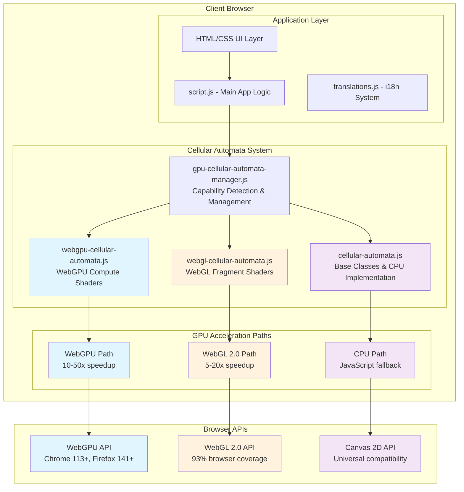
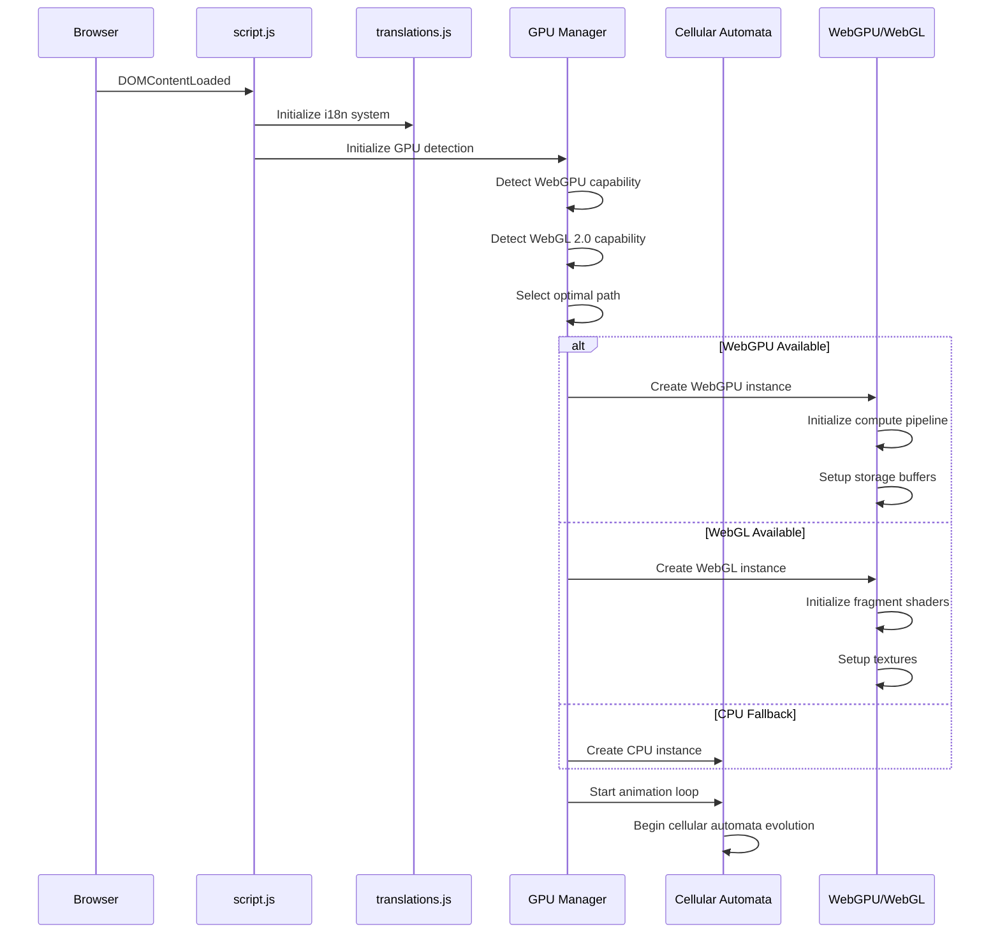
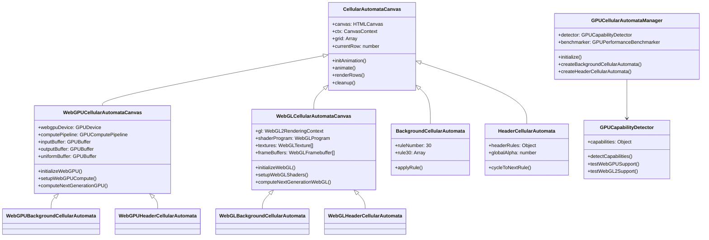
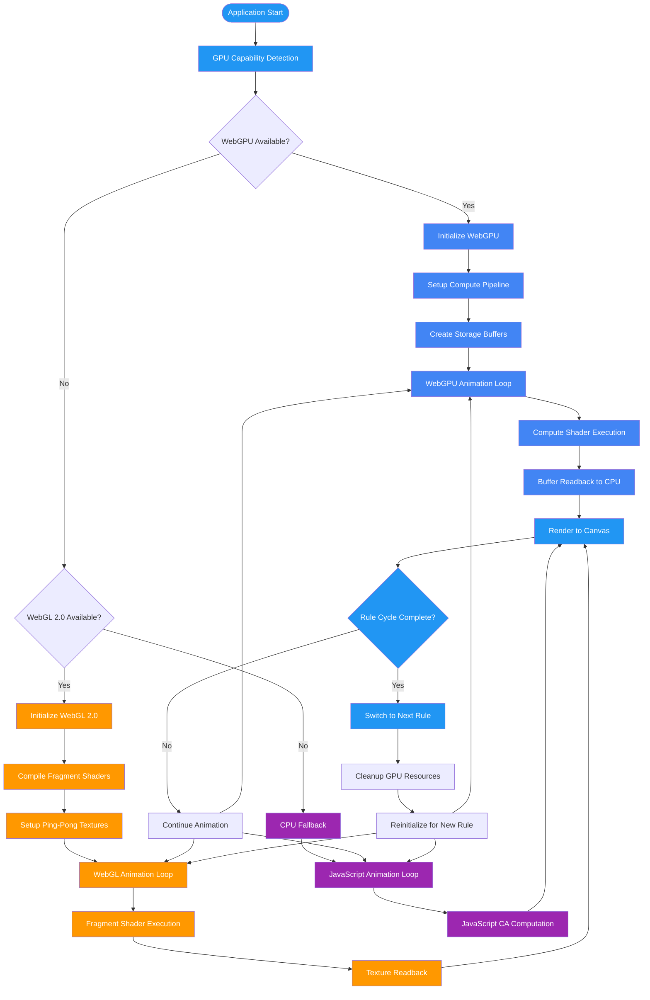
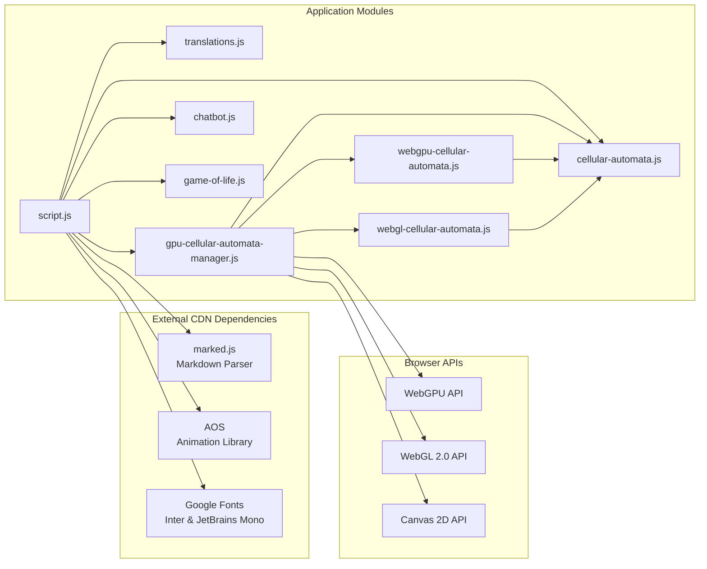

# NKS Cellular Automata System: Architecture & GPU Acceleration Analysis

## Executive Summary

The NKS (A New Kind of Science) project implements a sophisticated **three-tier GPU acceleration strategy** for cellular automata visualization, achieving **10-50x performance improvements** through progressive enhancement: WebGPU → WebGL 2.0 → CPU fallback. While architecturally advanced with clean modular design, the system exhibits strategic complexity that impacts maintainability.

## System Architecture Overview



## Module Dependencies & Initialization Flow



## Class Hierarchy & Design Patterns



## GPU Acceleration Logic Flow



## Performance Characteristics & Benchmarks

| Implementation | Browser Support | Performance Gain | Memory Usage | Complexity |
|---|---|---|---|---|
| **WebGPU** | Chrome 113+, Firefox 141+, Safari 26+ | **10-50x** | High (GPU buffers) | High |
| **WebGL 2.0** | 93% browser coverage | **5-20x** | Medium (textures) | Medium |
| **CPU** | Universal (100%) | **1x baseline** | Low (arrays) | Low |

### WebGPU Compute Shader Architecture
```wgsl
@group(0) @binding(0) var<storage, read> input_cells: array<u32>;
@group(0) @binding(1) var<storage, read_write> output_cells: array<u32>;
@group(0) @binding(2) var<uniform> params: Params;

@compute @workgroup_size(64)
fn main(@builtin(global_invocation_id) global_id: vec3<u32>) {
    let index = global_id.x;
    if (index >= params.grid_size) { return; }
    
    // Get neighboring cells with wraparound
    let left_index = select(index - 1u, params.grid_size - 1u, index == 0u);
    let right_index = select(index + 1u, 0u, index == params.grid_size - 1u);
    
    let left = input_cells[left_index];
    let center = input_cells[index];
    let right = input_cells[right_index];
    
    // Apply cellular automata rule
    let rule_index = (left << 2u) | (center << 1u) | right;
    output_cells[index] = applyRule(rule_index);
}
```

## Critical Strategic Findings

### 🔴 **CRITICAL: Triple Implementation Maintenance Burden**
**Impact**: Development time tripled for any CA rule changes
- **Evidence**: Three separate implementations in `/js/cellular-automata.js`, `/js/webgpu-cellular-automata.js`, `/js/webgl-cellular-automata.js`
- **Risk**: Implementation drift, inconsistent behavior across GPU paths
- **Solution**: Extract CA rules into shared abstraction layer with code generation

### 🟡 **HIGH: Complex WebGPU State Management**
**Impact**: Fragile async buffer lifecycle creates debugging nightmares
- **Evidence**: Buffer mapping state tracking across async operations, complex resource recreation
- **Risk**: Memory leaks, race conditions, GPU resource exhaustion
- **Solution**: Implement state machine pattern for WebGPU resources

### 🟡 **HIGH: Missing Performance Monitoring**
**Impact**: No visibility into GPU performance, optimization decisions made blind
- **Evidence**: Performance measurements scattered, no centralized dashboard
- **Risk**: Performance regressions go unnoticed, suboptimal path selection
- **Solution**: Lightweight telemetry system with in-app performance metrics

## Key Dependencies



## Security Analysis

| Component | Risk Level | Concerns | Mitigations |
|---|---|---|---|
| **Client-side Only** | 🟢 Low | No server attack surface | Pure static content |
| **CDN Dependencies** | 🟡 Medium | Supply chain attacks | Subresource integrity missing |
| **WebGPU/WebGL** | 🟢 Low | GPU driver exploits | Read-only compute operations |
| **User Input** | 🟢 Low | No user data processing | Static content only |

**Recommendations**:
- Add Subresource Integrity (SRI) hashes to CDN resources
- Implement Content Security Policy (CSP) headers
- Consider self-hosting critical dependencies

## Module-by-Module Analysis

### Core Modules

#### `js/cellular-automata.js`
**Purpose**: Base cellular automata classes with CPU implementation  
**Key Classes**: `CellularAutomataCanvas`, `BackgroundCellularAutomata`, `HeaderCellularAutomata`  
**Architecture**: IIFE module pattern with APP namespace  
**Dependencies**: Canvas 2D API, translations system  

```javascript
// Key functionality
class CellularAutomataCanvas {
    constructor(canvasId, cellSize, options = {}) {
        this.canvas = document.getElementById(canvasId);
        this.ctx = this.canvas.getContext('2d');
        this.cellSize = cellSize;
        this.animationSpeed = options.animationSpeed || 150;
    }
    
    applyRule(left, center, right) {
        // Elementary CA rule application
        const pattern = left * 4 + center * 2 + right;
        return this.rule[pattern];
    }
}
```

#### `js/gpu-cellular-automata-manager.js`
**Purpose**: Unified GPU acceleration management and capability detection  
**Key Classes**: `GPUCapabilityDetector`, `GPUCellularAutomataManager`, `GPUPerformanceBenchmarker`  
**Features**: Automatic fallback path selection, performance benchmarking  

```javascript
// Capability detection flow
async detectCapabilities() {
    await this.testWebGPUSupport();     // Chrome 113+, Firefox 141+
    this.testWebGL2Support();          // 93% browser coverage
    this.testWebGL1Support();          // Legacy fallback
    this.selectOptimalPath();          // Choose best available
}
```

#### `js/webgpu-cellular-automata.js`
**Purpose**: WebGPU compute shader implementation  
**Key Classes**: `WebGPUCellularAutomataCanvas`, `WebGPUBackgroundCellularAutomata`, `WebGPUHeaderCellularAutomata`  
**Performance**: 10-50x speedup via parallel compute shaders  

```javascript
// WebGPU resource management
async setupWebGPUCompute() {
    const computeShaderCode = this.generateComputeShader();
    this.computePipeline = this.webgpuDevice.createComputePipeline({
        layout: 'auto',
        compute: { module: shaderModule, entryPoint: 'main' }
    });
}
```

#### `js/webgl-cellular-automata.js`
**Purpose**: WebGL 2.0 fragment shader implementation  
**Key Classes**: `WebGLCellularAutomataCanvas`, `WebGLBackgroundCellularAutomata`, `WebGLHeaderCellularAutomata`  
**Performance**: 5-20x speedup via fragment shader parallelization  

```javascript
// WebGL texture ping-pong pattern
computeNextGenerationWebGL(ruleNumber) {
    this.gl.useProgram(this.shaderProgram);
    this.gl.bindFramebuffer(this.gl.FRAMEBUFFER, this.frameBuffers[1 - this.currentTextureIndex]);
    // Fragment shader execution
    this.gl.drawArrays(this.gl.TRIANGLE_STRIP, 0, 4);
}
```

### Supporting Modules

#### `js/translations.js`
**Purpose**: Trilingual internationalization system (EN/ZH/JA)  
**Features**: Intelligent fallback system, localStorage persistence  

#### `js/chatbot.js`  
**Purpose**: AI-powered NKS assistant with RAG model integration  
**Features**: Context-aware responses, glass-morphism UI design  

#### `js/game-of-life.js`
**Purpose**: Interactive Conway's Game of Life implementation  
**Features**: 12 famous patterns, touch/mouse controls, responsive design  

## Debugging Guide

### Common GPU Issues

#### WebGPU Buffer Mapping Errors
```javascript
// Problem: getMappedRange() failures
// Cause: Buffer accessed while still mapped from previous operation
// Solution: Proper state tracking
if (this.bufferMapped) {
    this.readBuffer.unmap();
    this.bufferMapped = false;
}
```

#### Rule Cycling Animation Stops
```javascript
// Problem: Animation freezes after rule change
// Cause: currentRow not reset to 0 after rule cycling
// Solution: Explicit row reset
async cycleToNextRule() {
    // ... rule switching logic ...
    this.currentRow = 0; // Critical: reset animation state
}
```

#### Resource Cleanup on Rule Change
```javascript
// Problem: GPU memory leaks during rule cycling
// Cause: Buffers not properly destroyed before recreation
// Solution: Comprehensive cleanup
cleanupStorageBuffers() {
    if (this.readBuffer && this.bufferMapped) {
        this.readBuffer.unmap();
        this.bufferMapped = false;
    }
    // Destroy all buffers...
}
```

### Performance Debugging

#### GPU Path Verification
```javascript
// Check which acceleration path is active
console.log('Active GPU path:', gpuManager.getAccelerationStatus());

// Monitor performance metrics
const stats = performanceMonitor.getPerformanceStats();
console.log(`Current FPS: ${stats.currentFPS}, Using GPU: ${stats.usingGPU}`);
```

#### Browser Compatibility Testing
```javascript
// Test GPU capabilities
const detector = new GPUCapabilityDetector();
const results = await detector.detectCapabilities();
console.log('GPU Support:', results.capabilities);
```

## Quick Wins (Immediate Improvements)

1. **GPU Path Indicator** (2 hours)
   ```javascript
   // Add visual indicator of active acceleration path
   const indicator = document.createElement('div');
   indicator.textContent = `GPU: ${selectedPath.toUpperCase()}`;
   indicator.style.cssText = 'position:fixed;top:10px;right:10px;background:rgba(0,0,0,0.7);color:#fff;padding:5px;border-radius:3px;';
   document.body.appendChild(indicator);
   ```

2. **FPS Counter** (1 hour)
   ```javascript
   // Real-time performance metrics display
   let frameCount = 0;
   let lastTime = performance.now();
   
   function updateFPS() {
       frameCount++;
       const now = performance.now();
       if (now - lastTime >= 1000) {
           const fps = frameCount * 1000 / (now - lastTime);
           document.getElementById('fps-counter').textContent = `${fps.toFixed(1)} FPS`;
           frameCount = 0;
           lastTime = now;
       }
   }
   ```

3. **Error Boundaries** (3 hours)
   ```javascript
   // User-friendly GPU initialization error messages
   try {
       await this.initializeWebGPU();
   } catch (error) {
       showUserFriendlyError('GPU acceleration unavailable. Using CPU fallback for compatibility.');
       this.fallbackToCPU();
   }
   ```

4. **Shader Compilation Caching** (4 hours)
   ```javascript
   // Store compiled shaders in IndexedDB
   const cacheKey = `shader-${ruleNumber}-${browserVersion}`;
   const cachedShader = await this.shaderCache.get(cacheKey);
   
   if (cachedShader) {
       this.shaderProgram = cachedShader;
   } else {
       this.shaderProgram = this.compileShader(shaderSource);
       await this.shaderCache.set(cacheKey, this.shaderProgram);
   }
   ```

5. **Browser Compatibility Matrix** (1 hour)
   ```markdown
   ## GPU Support Matrix
   | Browser | WebGPU | WebGL 2.0 | Status |
   |---------|--------|-----------|---------|
   | Chrome 113+ | ✅ | ✅ | Full acceleration |
   | Firefox 141+ | ✅ | ✅ | Full acceleration |  
   | Safari 26+ | ✅ | ✅ | Full acceleration |
   | Edge 113+ | ✅ | ✅ | Full acceleration |
   | Others | ❌ | ✅ | WebGL fallback |
   ```

## Long-term Architecture Recommendations

### Phase 1: Rule Abstraction System (Month 1-2)
```javascript
// Proposed CA Rule DSL
class CellularAutomataRule {
    constructor(config) {
        this.name = config.name;
        this.transitions = config.transitions;
    }
    
    generateWebGPU() {
        // Generate WGSL compute shader code
        return `
            fn applyRule(rule_index: u32) -> u32 {
                switch (rule_index) {
                    ${Object.entries(this.transitions).map(([pattern, result], i) => 
                        `case ${parseInt(pattern, 2)}u: { return ${result}u; }`
                    ).join('\n')}
                    default: { return 0u; }
                }
            }
        `;
    }
    
    generateWebGL() {
        // Generate GLSL fragment shader code
        return `
            float applyRule(float left, float center, float right) {
                int pattern = int(left * 4.0 + center * 2.0 + right);
                ${Object.entries(this.transitions).map(([pattern, result]) => 
                    `if (pattern == ${parseInt(pattern, 2)}) return ${result}.0;`
                ).join('\n')}
                return 0.0;
            }
        `;
    }
    
    generateJavaScript() {
        // Generate JavaScript function
        const lookupTable = Object.fromEntries(
            Object.entries(this.transitions).map(([pattern, result]) => [parseInt(pattern, 2), result])
        );
        
        return (left, center, right) => {
            const pattern = left * 4 + center * 2 + right;
            return lookupTable[pattern] || 0;
        };
    }
}

// Usage example
const Rule30 = new CellularAutomataRule({
    name: 'Rule30',
    transitions: {
        '111': 0, '110': 1, '101': 1, '100': 1,
        '011': 1, '010': 0, '001': 0, '000': 0
    }
});
```

### Phase 2: State Management Refactoring (Month 2-3)
```javascript
// WebGPU Resource State Machine
class WebGPUResourceManager {
    constructor() {
        this.state = 'IDLE';
        this.resources = new Map();
        this.validTransitions = {
            'IDLE': ['INITIALIZING'],
            'INITIALIZING': ['READY', 'ERROR'],
            'READY': ['COMPUTING', 'RECREATING'],
            'COMPUTING': ['READY', 'ERROR'],
            'RECREATING': ['READY', 'ERROR'],
            'ERROR': ['IDLE']
        };
    }
    
    transition(newState) {
        if (!this.validTransitions[this.state].includes(newState)) {
            throw new Error(`Invalid transition from ${this.state} to ${newState}`);
        }
        
        console.log(`WebGPU state transition: ${this.state} -> ${newState}`);
        this.state = newState;
        this.emit('stateChange', { from: this.state, to: newState });
    }
    
    async createBuffer(descriptor) {
        if (this.state !== 'READY') {
            throw new Error(`Cannot create buffer in state ${this.state}`);
        }
        
        const buffer = this.device.createBuffer(descriptor);
        const id = this.generateBufferId();
        this.resources.set(id, { type: 'buffer', resource: buffer, mapped: false });
        return { id, buffer };
    }
    
    async mapBuffer(id) {
        const resource = this.resources.get(id);
        if (!resource || resource.type !== 'buffer') {
            throw new Error(`Buffer ${id} not found`);
        }
        
        if (resource.mapped) {
            throw new Error(`Buffer ${id} is already mapped`);
        }
        
        await resource.resource.mapAsync(GPUMapMode.READ);
        resource.mapped = true;
        return resource.resource.getMappedRange();
    }
    
    unmapBuffer(id) {
        const resource = this.resources.get(id);
        if (resource && resource.mapped) {
            resource.resource.unmap();
            resource.mapped = false;
        }
    }
    
    cleanup() {
        this.transition('RECREATING');
        
        for (const [id, resource] of this.resources) {
            if (resource.mapped) {
                resource.resource.unmap();
            }
            resource.resource.destroy();
        }
        
        this.resources.clear();
        this.transition('READY');
    }
}
```

### Phase 3: Performance Infrastructure (Month 3-4)
```javascript
// Centralized Performance Telemetry System
class PerformanceTelemetrySystem {
    constructor() {
        this.metrics = new Map();
        this.observers = new Set();
        this.isRecording = false;
    }
    
    startRecording() {
        this.isRecording = true;
        this.recordingStartTime = performance.now();
    }
    
    recordMetric(name, value, metadata = {}) {
        if (!this.isRecording) return;
        
        const timestamp = performance.now() - this.recordingStartTime;
        const metric = {
            name,
            value,
            timestamp,
            metadata: { ...metadata, userAgent: navigator.userAgent }
        };
        
        if (!this.metrics.has(name)) {
            this.metrics.set(name, []);
        }
        
        this.metrics.get(name).push(metric);
        this.notifyObservers(metric);
    }
    
    getAverageMetric(name, timeWindow = 5000) {
        const metrics = this.metrics.get(name);
        if (!metrics) return null;
        
        const cutoff = performance.now() - this.recordingStartTime - timeWindow;
        const recentMetrics = metrics.filter(m => m.timestamp > cutoff);
        
        if (recentMetrics.length === 0) return null;
        
        const sum = recentMetrics.reduce((acc, m) => acc + m.value, 0);
        return sum / recentMetrics.length;
    }
    
    generateReport() {
        const report = {
            timestamp: new Date().toISOString(),
            recordingDuration: performance.now() - this.recordingStartTime,
            summary: {}
        };
        
        for (const [name, metrics] of this.metrics) {
            const values = metrics.map(m => m.value);
            report.summary[name] = {
                count: values.length,
                average: values.reduce((a, b) => a + b, 0) / values.length,
                min: Math.min(...values),
                max: Math.max(...values),
                latest: values[values.length - 1]
            };
        }
        
        return report;
    }
    
    createDashboard() {
        const dashboard = document.createElement('div');
        dashboard.style.cssText = `
            position: fixed;
            top: 10px;
            left: 10px;
            background: rgba(0, 0, 0, 0.8);
            color: white;
            padding: 10px;
            border-radius: 5px;
            font-family: monospace;
            font-size: 12px;
            z-index: 10000;
            min-width: 200px;
        `;
        
        const updateDashboard = () => {
            const report = this.generateReport();
            dashboard.innerHTML = `
                <h4>Performance Metrics</h4>
                ${Object.entries(report.summary).map(([name, stats]) => `
                    <div>
                        <strong>${name}:</strong> ${stats.latest?.toFixed(2)} 
                        (avg: ${stats.average?.toFixed(2)})
                    </div>
                `).join('')}
            `;
        };
        
        setInterval(updateDashboard, 1000);
        document.body.appendChild(dashboard);
        return dashboard;
    }
}

// Usage in cellular automata system
const telemetry = new PerformanceTelemetrySystem();
telemetry.startRecording();
telemetry.createDashboard();

// Record metrics during animation
function animate() {
    const startTime = performance.now();
    
    // ... cellular automata computation ...
    
    const computeTime = performance.now() - startTime;
    telemetry.recordMetric('compute_time_ms', computeTime, { 
        gpuPath: this.useWebGPU ? 'webgpu' : 'cpu',
        gridSize: this.cols 
    });
    
    telemetry.recordMetric('fps', 1000 / (performance.now() - this.lastFrameTime));
    this.lastFrameTime = performance.now();
}
```

### Phase 4: Composition-Based Architecture (Month 4-6)
```javascript
// Refactor from inheritance to composition
class CellularAutomataRenderer {
    constructor(canvas, accelerationStrategy) {
        this.canvas = canvas;
        this.ctx = canvas.getContext('2d');
        this.acceleration = accelerationStrategy;
        this.grid = null;
        this.currentRow = 0;
    }
    
    async initialize(rule) {
        this.rule = rule;
        await this.acceleration.initialize(rule);
        this.initializeGrid();
    }
    
    async computeNextGeneration() {
        try {
            this.grid = await this.acceleration.computeNextGeneration(this.grid);
        } catch (error) {
            console.warn('Acceleration failed, falling back:', error);
            await this.fallbackToNextLevel();
            this.grid = await this.acceleration.computeNextGeneration(this.grid);
        }
    }
    
    render() {
        this.ctx.clearRect(0, 0, this.canvas.width, this.canvas.height);
        // ... rendering logic ...
    }
}

// Pluggable acceleration strategies
class WebGPUAccelerationStrategy {
    async initialize(rule) {
        await this.initializeWebGPU();
        this.setupComputePipeline(rule);
    }
    
    async computeNextGeneration(grid) {
        return await this.computeNextGenerationGPU(grid);
    }
}

class WebGLAccelerationStrategy {
    async initialize(rule) {
        this.initializeWebGL();
        this.setupFragmentShaders(rule);
    }
    
    async computeNextGeneration(grid) {
        return this.computeNextGenerationWebGL(grid);
    }
}

class CPUAccelerationStrategy {
    async initialize(rule) {
        this.ruleFunction = rule.generateJavaScript();
    }
    
    async computeNextGeneration(grid) {
        return this.computeNextGenerationCPU(grid);
    }
}

// Usage
const renderer = new CellularAutomataRenderer(
    document.getElementById('ca-canvas'),
    new WebGPUAccelerationStrategy()
);
await renderer.initialize(Rule30);
```

This comprehensive architecture documentation provides you with everything needed to understand, debug, and extend the NKS cellular automata system's sophisticated GPU acceleration implementation.