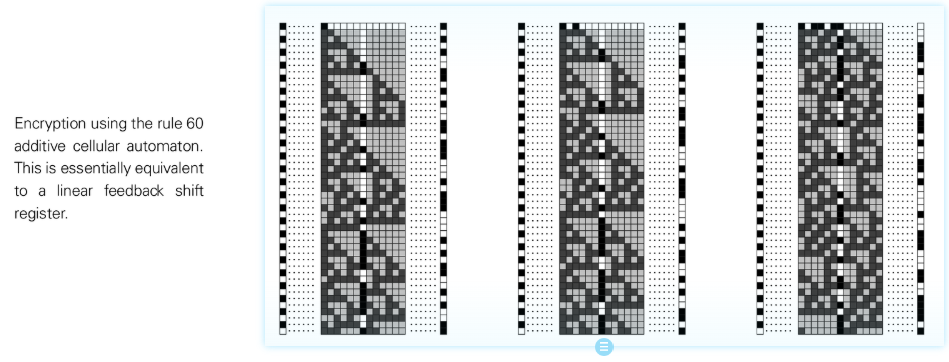

# Additive Cellular Automata

Additive Cellular Automata is a type of cellular automaton whose rules can be written in linear (modulo 2, etc.) summation form, such as Rule 60, Rule 90, etc. Its core feature is that the next state is an additive combination of neighborhood states, which can often be analyzed with linear algebra tools.

## Features
- **Linearity**: Updates can be written as linear combinations of neighbor states (Boolean addition/XOR).
- **Resolvability**: Behavior can be predicted by matrix, Fourier methods, and it is often difficult to generate truly unpredictable complexity.
- **Nested patterns**: often generate fractal or symmetrical structures (such as Sierpinski triangle), suitable as examples showing simple rules → complex structures.

## NKS association
- As a category 2/3 boundary case to help compare the complexity differences of linear versus non-linear rules.
- Easily cracked in cryptanalysis, emphasizing the need to avoid using additivity rules to generate randomness.

## Further reading
- S. Wolfram, *A New Kind of Science*, Chapter 3 & 6
- [Additive cellular automaton (Wikipedia)](https://en.wikipedia.org/wiki/Additive_cellular_automaton)