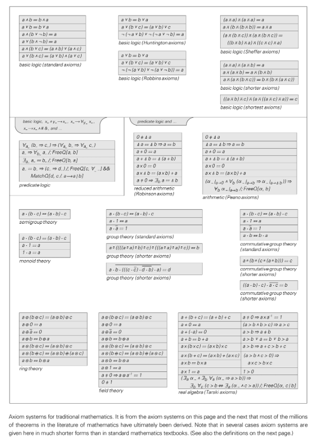

# Axiom

An axiom is a basic assumption in a mathematical or logical system that does not require proof and serves as the starting point for reasoning. Together they define the syntactic and semantic boundaries of the system, allowing all theorems to be derived from the axioms through limited inference rules.

## Core Features
- **Self-evidence or Conventionality**: Traditionally requiring "obviously true", the modern view allows axioms to be chosen by convention, as long as they meet the desired formal goals.
- **Independence**: An excellent axiom system strives to have each axiom not imply each other to avoid redundancy and ensure freedom of reasoning.
- **Consistency**: If an axiom contains both a certain proposition and its negative proposition, the system collapses. One of the core tasks in building an axiom set is to test for consistency.

## NKS perspective
- Simple axiom sets can also generate extremely complex theorem structures, echoing the theme of simple rules giving rise to complex behaviors.
- The principle of computational equivalence implies that most axiomatic systems may reach a complexity comparable to ubiquitous computing as long as they exceed the "obviously simple" threshold.
- Gödel's incompleteness theorem demonstrates computational irreducibility - for a sufficiently strong axiomatic system, there are always propositions that cannot be determined within the system.

## Related concepts
- Gödel's theorem
- Ubiquitous computing
- formal system

## Further reading
- [Axiom (Wikipedia)](https://en.wikipedia.org/wiki/Axiom)
- [Axiomatic system (Wikipedia)](https://en.wikipedia.org/wiki/Axiomatic_system)