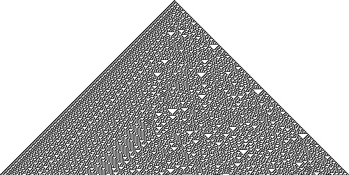
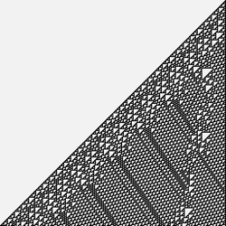
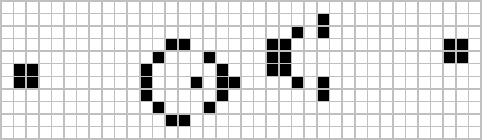

# Cellular Automata

Cellular automaton (CA) is a computing model formed by "cells" on a regular grid that are updated synchronously according to the same local rules at discrete time steps. Its power lies in the fact that extremely simple local updates can emerge with astonishing global complexity, including randomness, structure, propagation, computation, and life-like behavior.

- Grids and dimensions: one-dimensional, two-dimensional (such as the Game of Life), or higher-dimensional regular grid points.
- State set: usually a finite number of discrete states (most commonly binary 0/1).
- Neighborhood and range: such as one-dimensional three-neighborhood (self + left and right), two-dimensional von Neumann/Moore neighborhood, etc.
- Synchronous updates: all cells apply the same rules in parallel at each time step.

Note: The illustration shows the local mapping of different rules in the basic (1D, binary, three-neighborhood) rule family. Small differences can lead to completely different macro patterns.

## Why is it important?

- From simple to complex: the smallest components (more "atomistic" than differential equations) can also produce complex patterns such as turbulence, boundaries, particle-like structures, random textures, etc.
- Computational versatility: If rule 110 has been proven to be Turing complete, CA can achieve any valid calculation.
- Scientific methodology: Provide a test platform for studying "computational irreducibility", "emergence" and "simple rules generating complex worlds" (see the topic of "A New Science").

## Typical families and terms

- Basic one-dimensional CA (Elementary CA): two-valued, three-neighborhood (triple in the previous row → next state of the current element), a total of 256 rules (0–255).
- Two-dimensional life class (Conway’s Game of Life): a “birth/survival/death” rule family based on Moore’s neighborhood (8 neighbors).
- Neighborhood type:
  - Von Neumann neighborhood: cross shape, Manhattan distance 1.
  -Moore neighborhood: 3×3 squares, Chebyshev distance 1.
- Behavioral classification (Wolfram’s four categories):
  - Type I: tends towards homogeneity or fixed point.
  - Category II: periodic/tiled structures occur.
  - Category III: disorder, quasi-random (such as rule 30).
  - Category IV: "local structure" and interaction appear on the boundary, between order and chaos (e.g. Rule 110).

## Representative examples

### Rule 30 (Rule 30)

Rule 30 generates a highly irregular triangular texture under minimalist settings. The right half shows strong randomness and is often used as a source of pseudo-random bits:

- 
- 
- Interactive demo: `demos/wolfram-rules-explorer/wolfram-rules-explorer.html`
- Extended reading: `annotations/zh/rule-30.md`

### Rule 110 (Rule 110)

Rule 110 can emerge stable "particles" and interactions, and is Turing complete:

- 
- 

### Game of Life

The two-dimensional life class displays a wealth of mobile bodies (gliders), guns (glider cannons), oscillators, etc.:

- 
- Interactive demonstration: `demos/chapter3/turing-machine-demo.html` (related concepts), `demos/chapter3/chapter3-interactive.html`
- Extended reading: `annotations/zh/conways-game-of-life.md`

## Application overview

- Computation and Complexity: Demonstrates Turing completeness, irreducibility and unpredictability.
- Natural phenomena: simplified models of crystal growth, reaction diffusion, phase change front, traffic and diffusion, etc.
- Art generation: Utilize Type III/IV textures to generate patterns and animations (see `annotations/zh/computational-art.md`).