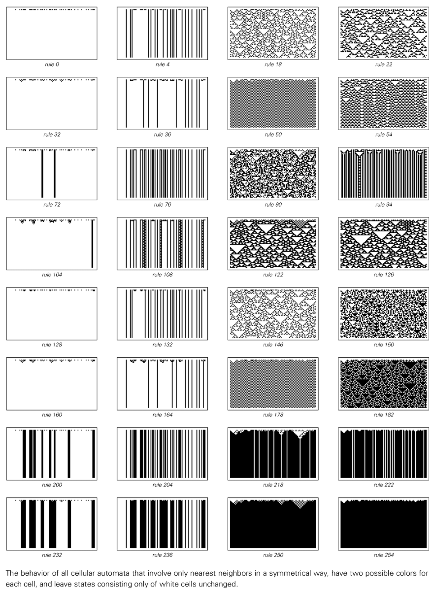
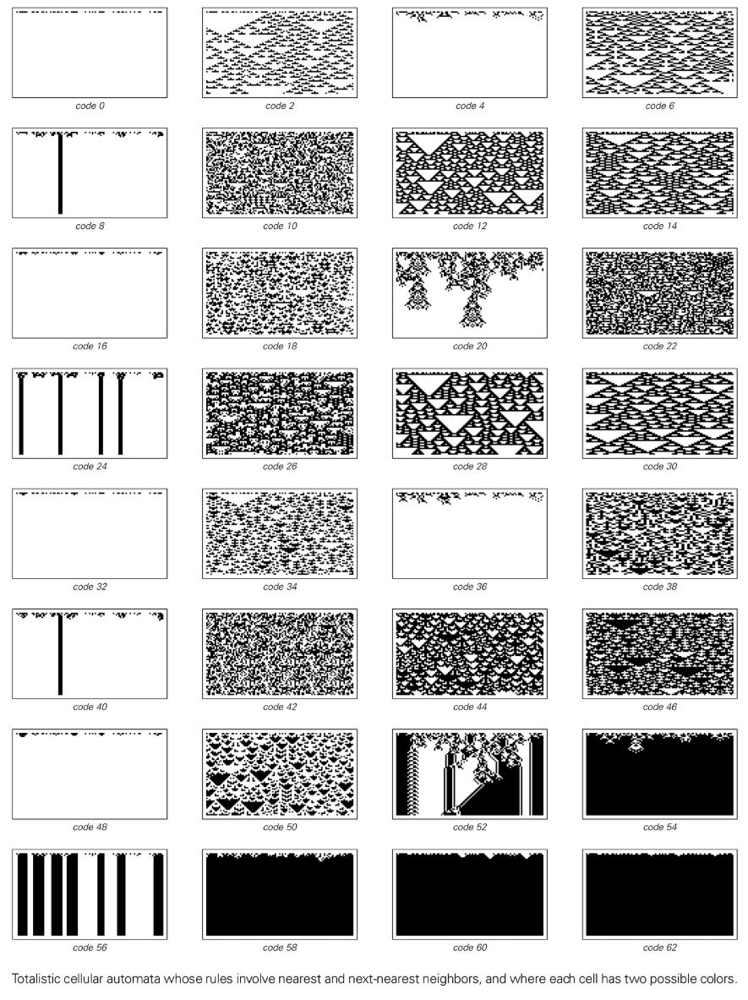
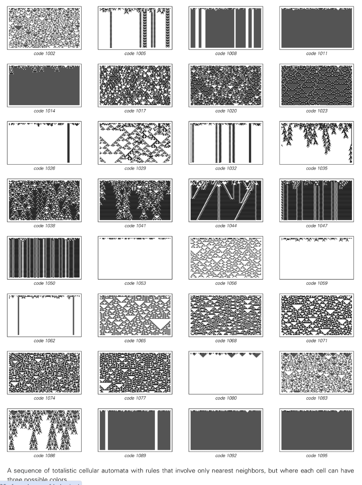

# Category 1 Cellular Automata

Category 1 (Wolfram Class I) describes the behavior of cellular automata that rapidly converges to a uniform or static configuration over a short period of time. No matter how complex the initial state is, the system will reach a fixed point that no longer changes after a finite number of steps.

## Typical characteristics

- **Fast Convergence**: The noise decays rapidly and the evolution sequence stops changing after a few steps.
- **END STATE SIMPLE**: The final pattern is usually all black, all white, or a uniform structure consisting of a small number of fixed blocks.
- **Lack of propagation**: Local disturbances do not propagate, and information is limited or disappears directly.

## represents rules

- Rules 0, 8, 32, 40, 128, 136, 160, 168, etc.

## Corresponding concepts

- Similar to the fixed point attractor in dynamical systems.
- In nature, it can be compared to the stable state of matter after entering thermal equilibrium or crystallization.

For more background, see [Four Classes Of Behavior](annotation:four-classes-of-behavior).