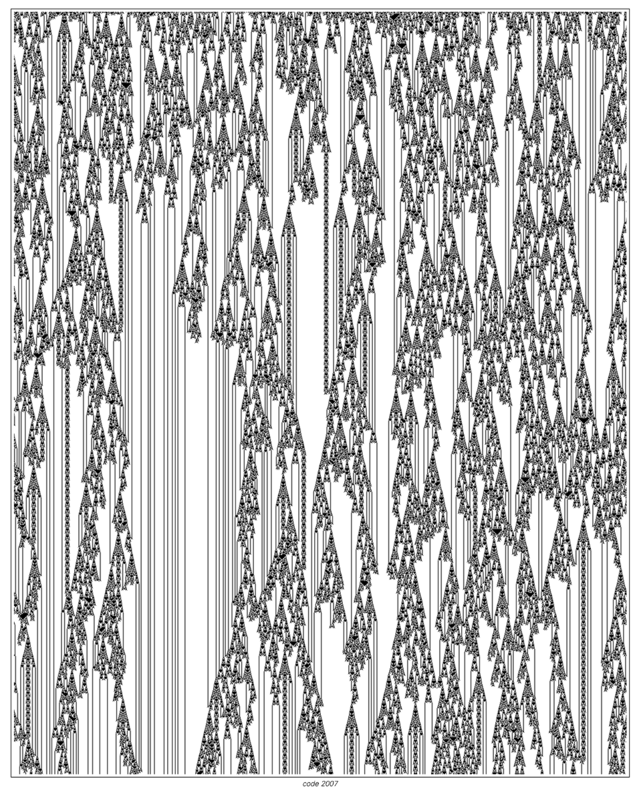

# Category 4 Cellular Automata

Class 4 (Wolfram Class IV) represents the richest and most fascinating type of behavior in cellular automata. Such systems sit on the "edge of complexity" between stable order and complete randomness, spontaneously emerge with long-lasting local structures and exhibit highly complex interactions.

## Typical characteristics

- **Local Structure**: Formation of sustainable "particles" or "gliders" that can move and carry information.
- **Complex interactions**: When different structures collide, multiple reactions will occur, such as reflection, absorption, splitting, or the creation of new structures.
- **Mixed Background**: Order and randomness coexist, backgrounds often have periodic or quasi-periodic textures.

## represents rules

- **Rule 110**: Proven to be Turing complete.
- Rules 54, 124, 137, etc. also show complex interactions and possible computational capabilities.

## Dynamic meaning

- **Computational Generality**: Many Category 4 systems have the potential to simulate arbitrary computations and are a cornerstone of the study of natural computation and computational irreducibility.
- **Information Transmission**: Local structures can be regarded as "logical signals", and their collisions can implement logical operations.
- **Critical Phenomenon**: Often considered to be a borderline state between Category 2 (Cyclic) and Category 3 (Random).

For more background, see the detailed discussion in [Four Classes Of Behavior](annotation:four-classes-of-behavior) and [Rule 110](annotation:rule-110).