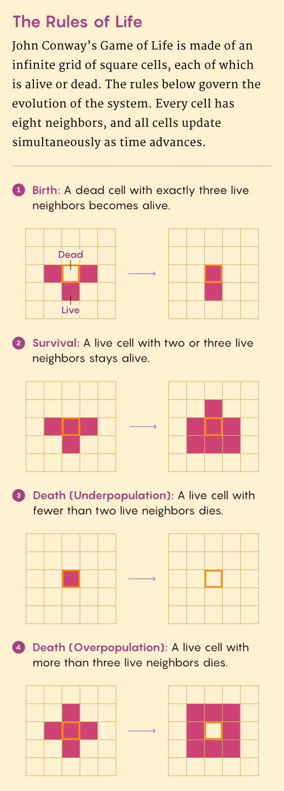
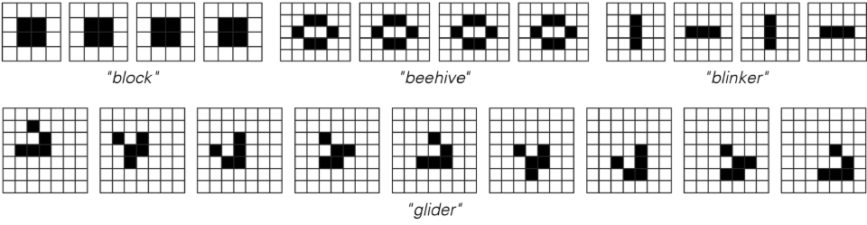
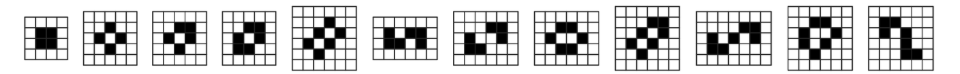
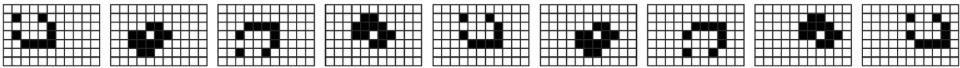
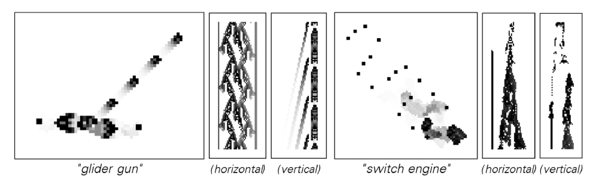
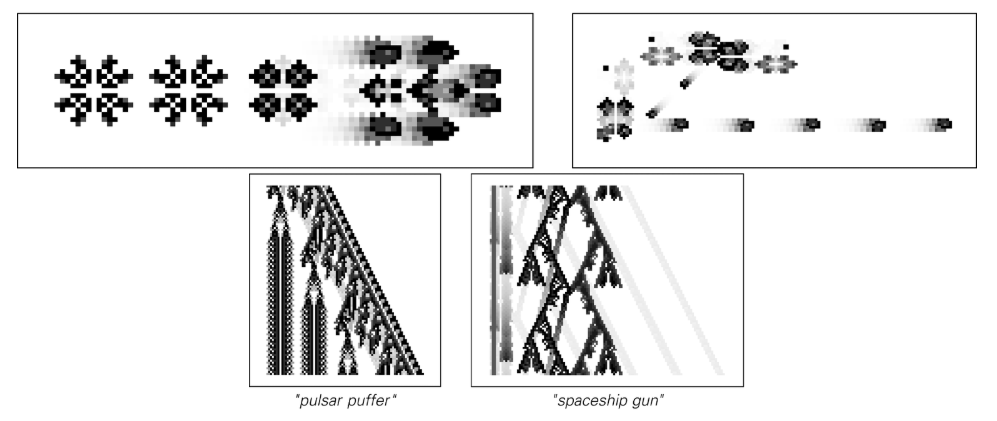

# Conway Game Of Life

The Game of Life, often referred to as "Life", is a "zero-player game" created by mathematician John Horton Conway in 1970. This means that its evolution is entirely determined by its initial state, with no further input from the player.

The game is played on a two-dimensional grid of cells, and each cell has two states: "alive" or "dead". The state of each cell in the next generation is determined by the current states of its eight surrounding neighbors through four simple rules:

1. **Underpopulation**: If a living cell has less than two neighbors, it will die.
2. **Stable Survival**: If a living cell has two or three neighbors, it will survive to the next generation.
3. **Overpopulation**: If a living cell has more than three neighbors, it will die.
4. **Reproduction**: If a dead cell has exactly three live neighbors around it, it will become a live cell.

From these simple rules, a wide variety of complex and evolving patterns can emerge, including stable "still lifes," repeating "oscillators," and "spaceships" that move on a grid like the famous "glider." The Game of Life is a profound example of how vast complexity can emerge from simple initial states and rules, a central theme of A New Science.

## Historical background and popular culture

- In 1970, Martin Gardner first reported on the Game of Life in Scientific American's "Mathematical Games" column, quickly sparking global interest.
- The Game of Life became an iconic example of early "hacker culture" and the personal computer community, with many enthusiasts writing programs to simulate its evolution.
- It has inspired countless creations of art, music, film and literature, and represents a metaphor for self-organization and the emergence of life.

## Typical structure

- **Still lives**: Such as Block, Boat, Beehive, these patterns remain unchanged once they appear.

- **Oscillators**: Such as Blinker, Toad, and Pulsar, repeating in a fixed period.

- **Spaceships**: Glider, Lightweight Spaceship (LWSS), etc., will move on the grid.

- **Glider guns**: Gosper Glider guns and other structures can continuously spawn gliders for unlimited growth.

- **Complex Machines**: By combining gliders, reflectors and logic gates, people have built registers, counters and even complete Turing machines.

## Calculation meaning

- The Game of Life has been proven to be Turing complete and can theoretically simulate any computational process.
- Its evolution reflects computational irreducibility: it is difficult to make concise predictions about the long-term behavior of the pattern and must be calculated step by step.
- As a classic benchmark for studying complex systems, emergent phenomena and artificial life, it is widely used in teaching and experiments.

## Resources and Tools

- [ConwayLife.com](https://www.conwaylife.com/): Contains a large number of pattern libraries, discussions and tools.
- Open source software such as Golly and LifeViewer can efficiently simulate the game of life and its variants.
- After Conway's death, researchers continued to explore new structures, such as faster spacecraft and more compact universal structures.