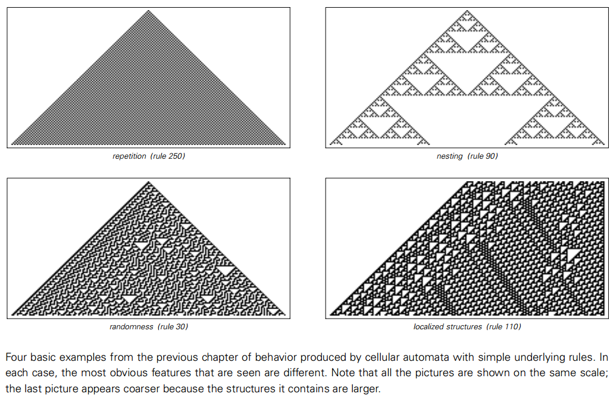
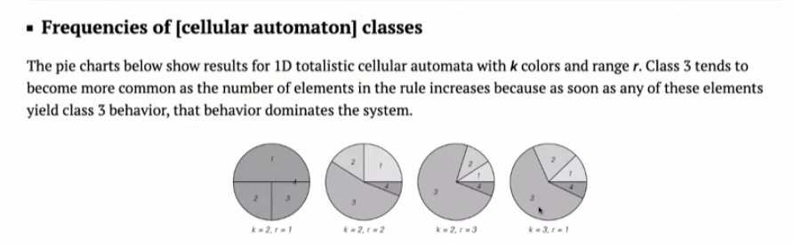

# Four behavior categories

A central finding in A New Science is that the behavior of simple programs, when observed, tends to fall into one of four basic categories. This classification provides a framework for understanding the entire computing universe.

## Category

**Category 1: Duplicate**
- **Description**: The system quickly stabilizes to a stable and unified state. After a few steps, the pattern either becomes fixed or repeats in simple cycles.
- **Analogy**: A pendulum that has stopped swinging, or a crystal that forms a regular lattice.

**Category 2: Nesting**
- **Description**: The system produces regular, self-similar patterns where structures are nested within larger versions of themselves. This often results in complex fractal-like shapes.
- **Analogy**: The branches of a tree branching, or the structure of a snowflake.

**Category 3: Random**
- **Description**: The system's behavior appears chaotic and random, with no discernible order or predictable pattern. It is similar to statistical noise.
- **Analogy**: Molecules in a gas, or snowflakes on a TV screen.

**Category 4: Complex**
- **Description**: This is the most interesting category. The system produces a mixture of order and randomness. It has local structures that can move, interact, and persist over time. These structures can be viewed as primitive forms of information processing, carrying and modifying data as they interact.
- **Analogy**: Complex interactions within living organisms, or the flow of information in computers.

## Meaning

The existence of these four categories is a common phenomenon, appearing in a wide variety of computing systems. The discovery of Category 4 behavior is particularly important because it shows that the ability to support complex computations is not a rare or fragile property, but a common feature of the computing universe. This has profound implications for understanding the origins of complexity in nature.