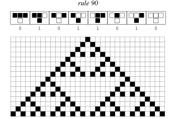
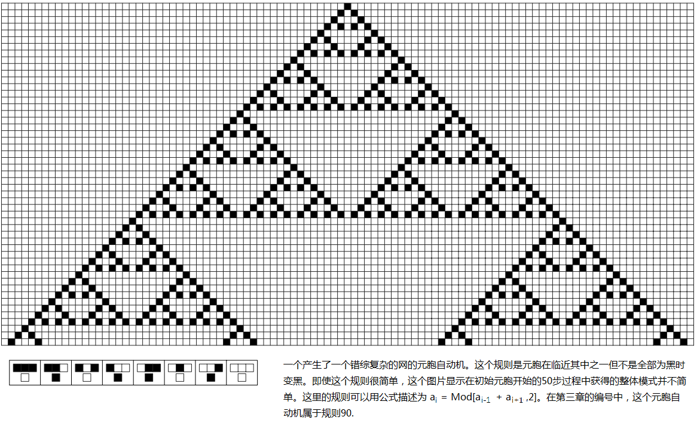

# Fractal

Fractals are geometric shapes that display self-similarity at all scales—meaning they look similar whether you zoom in or out. They are characterized by infinite detail, infinite length, and often fractional dimensions.

## Key Features

**Self-similarity**: The same pattern repeats at different scales. The small parts of a fractal look like the whole.

**ENDLESS DETAILS**: No matter how many times you magnify a fractal, you can always find more complex structures.

**Fractional Dimensions**: Unlike regular shapes (lines are one-dimensional, squares are two-dimensional), fractals can have dimensions like 1.5 or 2.3.

**Recursive Generation**: Most fractals are created by repeating a simple process over and over again.

## Famous examples

**Mandelbrot Set**: Probably the most famous fractal, discovered by Benoit Mandelbrot, with a complex spiral and spherical structure.

**Koch Snowflake**: Created by repeatedly adding triangular bumps to each side of a triangle.

**Sierpinski Triangle**: Formed by recursively removing triangular parts from a larger triangle.

*Sierpinski triangles emerge naturally from regular 90 cellular automata, demonstrating the connection between computational processes and fractal geometry*

*Nested triangle patterns generated by cellular automata, demonstrating self-similarity and fractal structure*

*Detailed evolution of nested patterns, showing how simple rules can produce complex fractal structures*

**Fern Leaf**: A computer-generated fractal that closely resembles a natural fern leaf.

## Fractal in nature

Nature is full of fractal-like structures:
-Coastlines and mountains
- branches and roots
- Blood vessels and lung airways
- Cloud and lightning modes
- Snowflakes and crystals

## Mathematical Discovery

Although fractal-like objects were studied early on, modern fractal geometry was developed primarily by Benoit Mandelbrot in the 1970s. He coined the term "fractal" from the Latin "fractus" meaning to break or divide.

## Significance of Wolfram’s work

Traditional fractals display nested, repeating patterns. Wolfram's work explores how simple computational rules can generate more complex patterns that far exceed the conventional self-similarity of classical fractals.

## learn more

For more information, please visit [Wikipedia's article on fractals](https://zh.wikipedia.org/wiki/fractals).