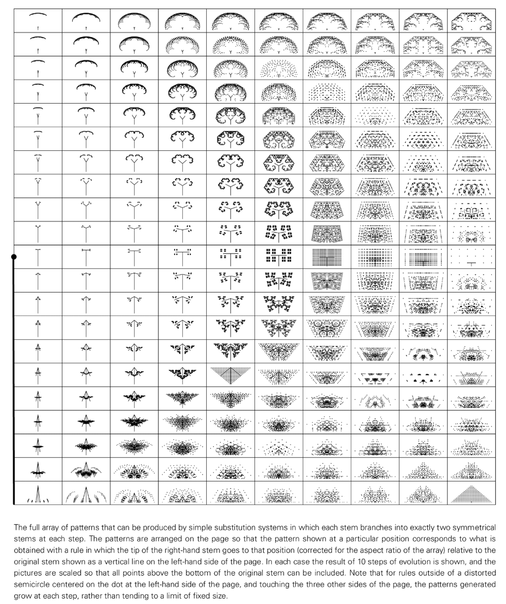

# Leaf shape generation

Leaf morphogenesis studies the mechanism by which plant leaves form specific geometric shapes, division patterns and vein structures during development.

## Key factors
- **Growth Rate Gradient**: Differences in growth rates in different areas of the leaf leading to curling, bifurcation or tip splitting.
- **Biochemical pattern formation**: Hormones (such as auxin) and transcription factors form concentration patterns on the leaf surface to guide cell differentiation.
- **Mechanical constraints**: Tissue tension and elasticity cause bending or folding, forming wavy edges or folds.

## Models and methods
- **L-System with Replacement Rules**: Procedural generation of blade outlines and veins.
- **Reaction-Diffusion and Turing Model**: Explain stripe/spot structures such as blade ridges and vein sequences.
- **Cellular Automata and Lattice Model**: Simulate leaf growth and vein expansion through local rules.

## NKS perspective
- Simple rules (such as local replacement, threshold decision-making) can produce the rich variety of shapes of natural leaves.
- Demonstrates the coexistence of "complex forms driven by local information" and "intrinsic randomness".
- illustrates that complexity in natural forms often emerges without complex optimization goals.

## Further reading
- [Leaf shape (Wikipedia)](https://en.wikipedia.org/wiki/Leaf_shape)
- [Phyllotaxis (Wikipedia)](https://en.wikipedia.org/wiki/Phyllotaxis)
- [L-system (Wikipedia)](https://en.wikipedia.org/wiki/L-system)