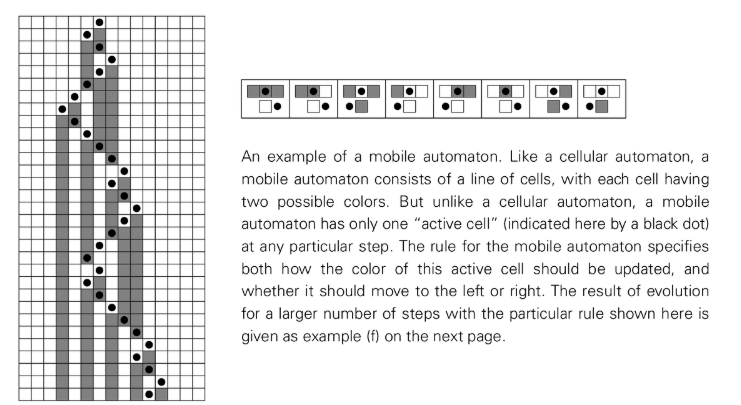

# moving automaton

A Mobile Automaton is a simple program similar to a Cellular Automaton, but with one key difference: instead of all cells updating in parallel at each step, there is only one active cell that updates and moves.

## Working principle

1. **A row of cells**: Like a cellular automaton, it consists of a one-dimensional array of cells, each with a color (e.g., black or white).
2. **One active cell**: At any given time, only one cell is designated as "active".
3. **Rules**: Rules only apply to this active unit. It looks at the colors of the active cell and its immediate neighbors.
4. **UPDATE AND MOVE**: Based on what you see, the rules specify two things:
    * New colors for active units.
    * Should the active unit move one position to the left or one position to the right.
5. **Next**: In the next step, the cell that was moved to becomes the new active cell, and the process repeats.

## Meaning

Moving automata are important because they break the assumption of parallel updates used in cellular automata. By studying them, Wolfram showed that even if this feature was removed, the same basic categories of behavior (including high levels of complexity) could still arise.

However, the process of finding complexity becomes much more difficult. While complex behavior is common in cellular automata, it is extremely rare in moving automata, often requiring a search through millions or even billions of possible rules to find examples. This suggests that, while the potential for complexity is universal, the *density* of complex rules can vary widely across different classes of systems.