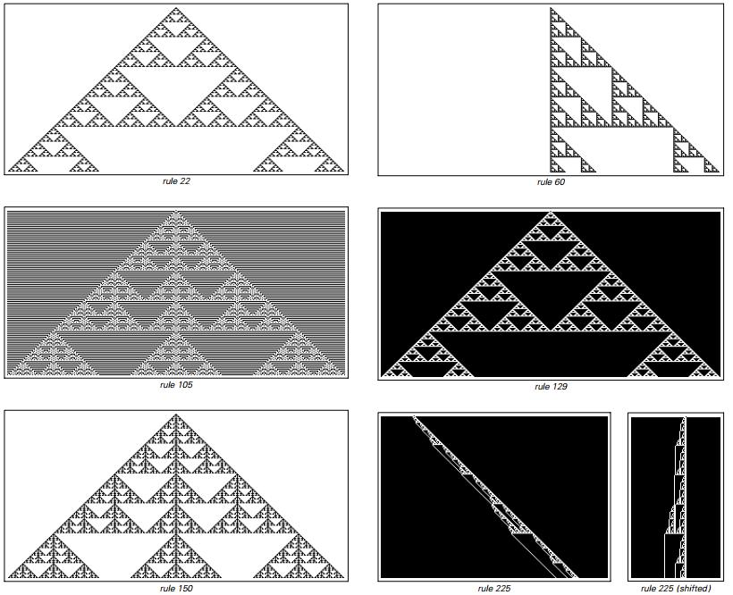

# Nested

In the A New Kind of Science (NKS) framework, “nestedness” refers to self-similar structures that recur at multiple scales. It is one of four typical types of behavior (uniform, repeated, nested, and approximately random) that often emerges naturally from extremely simple discrete rules.

## Why it matters in NKS
- Behavioral classification benchmark: Nesting is juxtaposed with "uniform/repeated/random" to form the first level of classification for observing complex systems.
- Simple rules → Rich forms: No complex design is required, long-range structures and multi-scale textures can appear only through local updates.
- Analyzable and compressible: Compared with random behavior, nesting is easier to explain, predict and compress (regular, additious, decomposable).

## Typical systems and mechanisms

### Basic Cellular Automata (ECA)
- Rule 90 (additivity/additivity): Starting from a single black element generates a nested pattern in the form of a Sierpinski triangle; its evolution is closely related to the binomial coefficient mod 2 (Pascal's triangle mod 2).
- Rule 150: Both belong to the additive class and present more complex nested fractal textures.

### Totalistic and multi-color rules
- Clear nested fractals often still appear in two-dimensional or higher color scales with multi-color or summation rules.
- This suggests that "nesting" is not a special case of one-dimensional or binary systems, but a common type of behavior across settings.

## How to understand NKS style
- Additivity and superposition: The additive rule can treat complex patterns as the superposition of multiple simple excitations, thereby explaining their regularity and compressibility.
- From local rules to global shapes: Strictly local updates and repeated iterations can construct cross-scale geometric structures, embodying the "bottom-up" generation paradigm.
- Dimensionality and universality: From one dimension to two dimensions and three dimensions, nesting still appears in large numbers, supporting the overall assertion that "complexity does not depend on high dimensions".

## Comparison with randomness and repetition
- Compared to repetition: nesting lacks a single period but maintains structural regularity at multiple scales.
- Compared with approximate randomness: clear geometric and hierarchical rules are visible in the nesting, and the information density and compressibility are higher.

## Further reading (external)
- NKS Online: Section 3.3 (Nested Fractals and Additivity)
- Sierpinski triangle (Background Mathematics and Visualization)
- [Fractal Geometry (Wikipedia)](https://en.wikipedia.org/wiki/Fractal)
- [Sierpinski Triangle (Wikipedia)](https://en.wikipedia.org/wiki/Sierpinski_triangle)
- [Nested patterns in cellular automata](https://www.wolframscience.com/nksonline/section-3.3)
- [Applications of fractals in nature](https://en.wikipedia.org/wiki/Factals_in_nature)