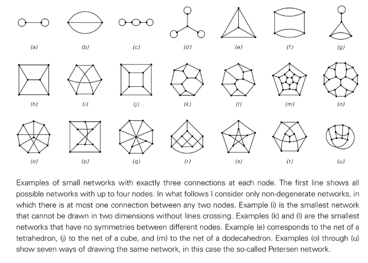

# Network Systems

A network system is a model in NKS that uses nodes and connections to describe states, and can cover graphs, hypergraphs, and their dynamic evolution.

## Features
- **Discrete Space Representation**: Nodes represent elements or "space points", and edges/hyperedges represent adjacency relationships.
- **Rule Evolution**: Update the network by replacing specific node clusters or connection patterns to produce complex shapes.
- **Causal Structure**: Rewriting the dependencies of events to form a causal network is a key tool for understanding space and time.

## Representative example
- Hypergraph replacement rules in the Wolfram Physics Project.
- Self-organizing topology and curvature demonstrated by simple network replacement.
- Convergence/bifurcation relationship diagram between paths in a multi-path system.

## NKS association
- Explain how continuous space, conserved quantities and physical laws emerge from discrete structures.
- Demonstrate core concepts such as "causal invariance" and "computational irreducibility".

## Further reading
- S. Wolfram, *A New Kind of Science*, Chapter 9
- [Wolfram Physics Project](https://www.wolframphysics.org/)