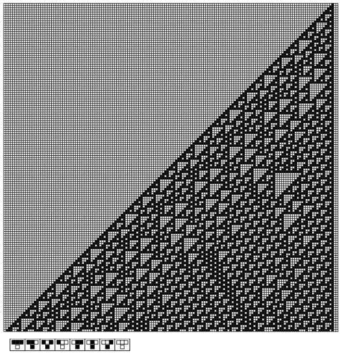
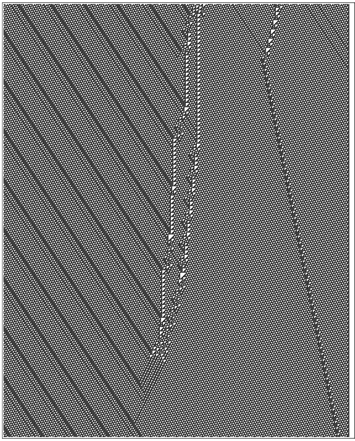

# Rule 110

Rule 110 is another landmark discovery of [Elementary Cellular Automata](https://en.wikipedia.org/wiki/Elementary_cellular_automaton) by Stephen Wolfram. Unlike the chaotic complexity of Rule 30, Rule 110 demonstrates the amazing properties of computational generality, proving that even extremely simple systems can perform arbitrary computations.

## Rule definition

Rule 110 also applies to a one-dimensional array of cells, where each cell can be black (1) or white (0). This rule determines each cell's next state based on its current state and the states of its two immediate neighbors.

This rule can be expressed as a simple lookup table:
- 111 → 0
- 110 → 1
- 101 → 1
- 100 → 0
- 011 → 1
- 010 → 1
- 001 → 1
- 000 → 0

The binary representation (01101110) is equal to 110 in decimal, hence the name "Rule 110".

## Key Features

### Calculation versatility
- **Turing Complete**: Able to simulate any Turing machine and perform arbitrary calculations
- **Local Structure**: Generate stable "particle" or "glider" structures
- **Background Pattern**: Triangular background structure with periodicity

### Structural behavior
- **Stable structures**: Some local structures remain stationary
- **Moving Structures**: Some structures move on the background at a constant speed
- **Collision Reaction**: Complex interactions occur when structures meet

## Visual pattern

*Rule 110 evolves from simple initial conditions to reveal complex local structures and background patterns*

*Rule 110 after more step iterations shows stable local structure interactions on repeated backgrounds*

*Detailed cellular automata visualization showing evolving patterns and local structure of Rule 110*

*The long-term evolution of Rule 110, demonstrating the complex interactions between structures*

When rule 110 is run, it generates a complex pattern with:
- Regular triangular background structure
- Local "particles" that move on the background
- Complex interactions produced when particles collide

*Detailed interaction of local structures in Rule 110, demonstrating the basis for computational generality*

## Scientific significance

### Breakthroughs in Computing Theory
The discovery of Rule 110 had a profound impact on the theory of computation:
- **Minimal Universal System**: Demonstrates that computational universality can be achieved in extremely simple systems
- **Natural Computing**: suggests that computational capabilities may be a universal property of natural systems
- **Complexity Threshold**: Determines the minimum complexity required to produce a general-purpose computation

### Proof process
Matthew Cook demonstrated the universality of Rule 110 from 1994-1998:
- Constructed a structure capable of simulating a cyclic labeling system
- Demonstrated that these structures can perform logical operations
- Shows how to build arbitrarily complex computational circuits

## Connections to other systems

Rule 110 has deep connections with other computing systems:
- **Turing machine**: capable of simulating the calculation of any Turing machine
- **Cellular Automata**: It is one of the four known universal types among the 256 basic cellular automata.
- **Natural Systems**: Provides a model for understanding information processing in biological and physical systems

## Application prospects

### Theory Application
- **Computational Complexity**: Study of boundary conditions for computational generality
- **Algorithm Design**: Inspire new parallel computing algorithms
- **Complexity Science**: Understanding information processing mechanisms in complex systems

### Practical application
- **Cryptography**: Designing encryption systems based on complex cellular automata
- **Artificial Intelligence**: Developing new computing architectures
- **Material Science**: Modeling the behavior of self-organizing and self-healing materials

## Further reading

- [Matthew Cook's Rule 110 Proof of Universality](https://www.complex-systems.com/abstracts/v14_i05_a01/)
- [Elementary Cellular Automata (Wikipedia)](https://en.wikipedia.org/wiki/Elementary_cellular_automaton)
- [Rule 110 (Wikipedia)](https://en.wikipedia.org/wiki/Rule_110)
- [Related chapters of Wolfram's "New Science"](https://www.wolframscience.com/nksonline/section-11.8)

