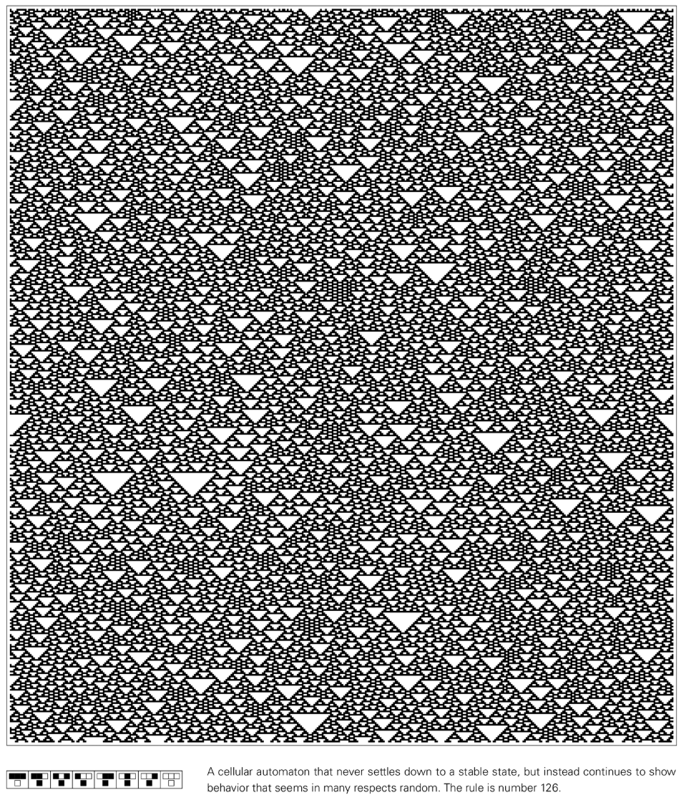
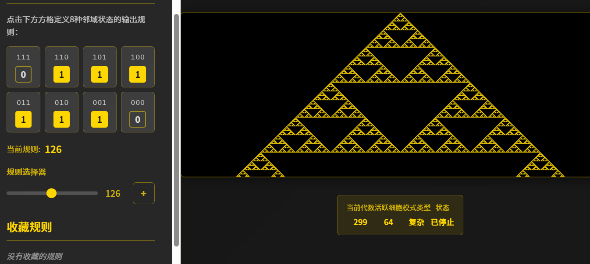

# Rule 126

Rule 126 is one of the [Elementary Cellular Automata](https://en.wikipedia.org/wiki/Elementary_cellular_automaton) proposed by Stephen Wolfram. Known for generating persistent random behavior from simple rules, it is an important case study of the coexistence of self-organization and randomness.

## Rule definition

Rule 126 operates on a one-dimensional array of cells, with each cell having two states: black (1) or white (0). The state of a cell in the next time step depends on the current state combination of itself and its two neighbors:

- 111 → 0
- 110 → 1
- 101 → 1
- 100 → 1
- 011 → 1
- 010 → 1
- 001 → 1
- 000 → 0

Reading the output as 01111110 in binary gives a decimal value of 126, hence the name "Rule 126".

## Behavioral characteristics

- **Continuous Randomness**: Whether starting from a single black cell or random initial conditions, evolution quickly becomes filled with seemingly random structures.
- **Hollow Triangular Structure**: Triangular holes composed of white cells will spontaneously appear in the dense black background, which is the iconic feature of the recognition rule 126.
- **High Density Background**: Since most local combinations result in a black output, the overall density is always biased towards black.
- **Local Correlation**: Although the pattern is approximately random, short-range correlations are retained locally, indicating that the behavior is not entirely noisy.

## Dynamics and Classification

- **Wolfram Category III**: Systems classified as "stochastic", exhibiting persistent disorder and chaos.
- **Sensitivity to initial conditions**: Small differences quickly amplify and the global pattern quickly loses recognizability of the initial conditions.
- **Nonlinear Superposition**: Unlike additivity rules such as Rule 90, the evolution of Rule 126 cannot be expressed as a simple superposition of initial states.
- **The attractor network is complex**: Traversing the state space shows that the number of attractors is huge and the period is often extremely long.

## Research significance

- **Sources of Randomness**: Provides a classic example of random behavior in a deterministic system without external noise.
- **Statistical Physics Model**: used to explore statistical properties such as density fluctuations, correlation functions, and non-equilibrium steady states.
- **Information Diffusion**: During the evolution process, information quickly diffuses to the whole world, providing material for studying irreversibility and calculation irreducibility.

## Further reading

- [Elementary Cellular Automata (Wikipedia)](https://en.wikipedia.org/wiki/Elementary_cellular_automaton)
- [Rule 126 (Wolfram MathWorld)](https://mathworld.wolfram.com/Rule126.html)
- [Discussion on stochastic initial conditions in "A New Science"](https://www.wolframscience.com/nksonline/section-6.2)