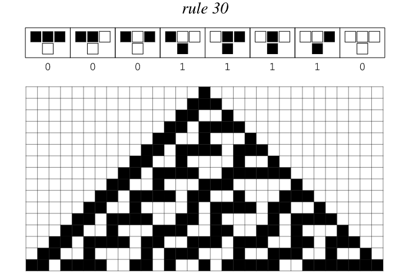
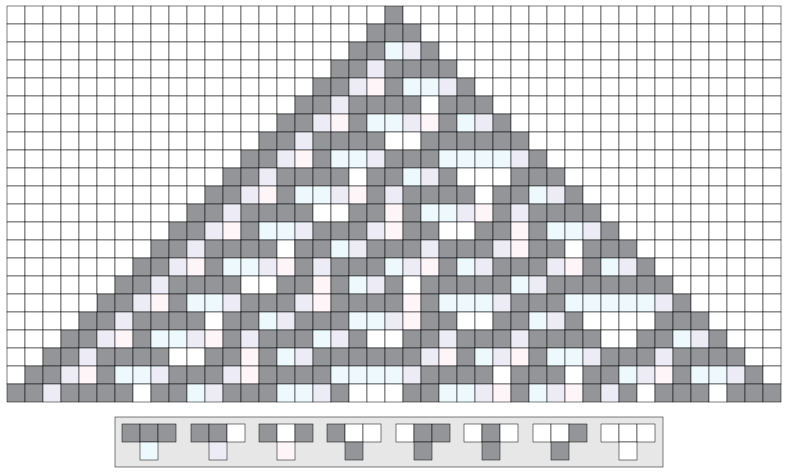

# Rule 30

Rule 30 is one of the most famous [Elementary Cellular Automata](https://en.wikipedia.org/wiki/Elementary_cellular_automaton) discovered by Stephen Wolfram. Despite its extremely simple rule structure, it produces complex, seemingly random patterns, revolutionizing our understanding of how complexity emerges from simplicity.

## Rule definition

Rule 30 operates on a one-dimensional array of cells, where each cell can be black (1) or white (0). This rule determines each cell's next state based on its current state and the states of its two immediate neighbors.

*Early evolution of Rule 30 from a single black cell, showing characteristic nesting patterns and emerging complexity*

*Detailed evolution of Rule 30, showing complex randomness arising from simple rules*

*Rule 30 evolved through more steps, showing continued complexity and randomness*

*Rule 30 after 500 iterations shows the full complexity arising from simple initial conditions*

This rule can be expressed as a simple lookup table:
- 111 → 0
- 110 → 0
- 101 → 0
- 100 → 1
- 011 → 1
- 010 → 1
- 001 → 1
- 000 → 0

The binary representation (00011110) is equal to 30 in decimal, hence the name "Rule 30".

## Key Features

### From simplicity comes complexity
- **Local simplicity**: only three neighbors are considered per cell
- **Global Complexity**: Generate complex, seemingly random patterns
- **Certainty**: Even though it seems random, every step is completely deterministic

### Computational characteristics
- **Irreducibility**: Cannot be simplified or predicted without running a full calculation
- **Sensitive to initial conditions**: small changes in starting configuration lead to drastically different results
- **Pseudo-random generation**: used in Mathematica's random number generator

## Visual pattern

*Detailed cellular automata visualization showing evolving patterns and structures of Rule 30*

When Rule 30 is run from simple initial conditions (usually a single black cell), it generates a triangle pattern with:
- Complex, nested structure of central ridge
- Displays the left side of the nested triangle pattern
- Right side that looks completely random

## Scientific significance

### Paradigm Shift
Rule 30 challenges fundamental assumptions in science:
- Overturns the notion that simple rules inevitably lead to simple behavior
- Demonstrated that apparent randomness can arise from deterministic processes
- Shows that complexity is ubiquitous in simple computing systems

### Application
- **Cryptography**: used to generate pseudo-random sequences
- **Computer Science**: Models for parallel computing and algorithm analysis
- **Physics**: Provides insights into [Chaotic Systems](https://en.wikipedia.org/wiki/Chaos_theory) and [Statistical Mechanics](https://en.wikipedia.org/wiki/Statistical_mechanics)
- **Biology**: Helps understand pattern formation in natural systems

## Connection with nature

The pattern of Rule 30 bears a striking resemblance to the following phenomena:
- Mollusk shell pattern
- Pigmentation patterns of animals
- fluid turbulence
- Crystal growth pattern

This suggests that similar simple rules may underlie pattern formation throughout nature.

## Further reading

- [Wolfram's 1983 original paper](https://www.stephenwolfram.com/publications/cellular-automata-irreversibility-randomness/)
- [Elementary Cellular Automata (Wikipedia)](https://en.wikipedia.org/wiki/Elementary_cellular_automaton)
- [Rule 30 (Wikipedia)](https://en.wikipedia.org/wiki/Rule_30)