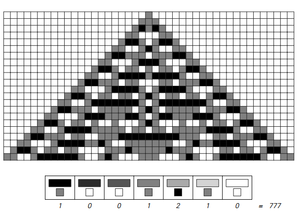

# Global cellular automaton

A Totalistic Cellular Automaton is a special type of cellular automaton in which the rule for determining a cell's next color depends only on the *sum* (or average) of the colors of its neighboring cells, regardless of their specific values ​​or positions.

## Working principle

In a standard primary cellular automaton, the rule looks at three cells (the cell itself and its left and right neighbors) for specific patterns. For example, `110` and `011` are different cases.

In a holistic automaton, the rules only care about the total value. If black=1 and white=0, then the rule treats `110` (sum=2) and `011` (sum=2) as the same case. This greatly reduces the number of possible situations that the rules need to define.

### Example

For a two-color (black/white), nearest neighbor global cellular automaton, there are only four possible sums over three cells:
- 0 (0+0+0)
- 1 (for example, 0+1+0)
- 2 (for example, 1+1+0)
- 3 (1+1+1)

Rules only need to specify outcomes for these four sums, which makes the rule space much smaller and easier to explore systematically.

## Meaning

The study of holistic cellular automata is important because it shows that the complexity observed in these systems does not depend on the intricate details of the rules. Even if the rules are simplified to only consider the total value of neighbors, the same basic four categories of behavior (repeated, nested, random, complex) still emerge. This provides strong evidence for the prevalence of these behaviors.