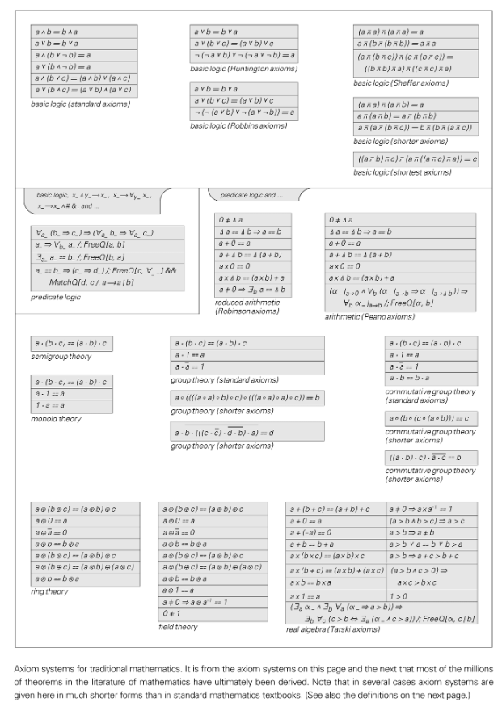

# 公理

公理とは、証明を必要とせず、推論の開始点として機能する数学的または論理的システムにおける基本的な仮定です。これらは一緒になってシステムの構文的境界と意味的境界を定義し、限られた推論ルールを通じて公理からすべての定理を導き出すことができます。

## コア機能
- **自明性または慣習性**: 伝統的には「明らかに真」であることが要求されていましたが、現代の見解では、所望の形式的目標を満たす限り、公理を慣例に従って選択することが認められています。
- **独立性**: 優れた公理システムは、冗長性を避け、推論の自由を確保するために、各公理が相互に暗示を持たないよう努めています。
- **一貫性**: 公理に特定の命題とその否定的な命題の両方が含まれる場合、システムは崩壊します。公理セットを構築する際の中心的なタスクの 1 つは、一貫性をテストすることです。

## NKS の視点
- 単純な公理セットは非常に複雑な定理構造を生成することもでき、複雑な動作を引き起こす単純なルールのテーマを反映しています。
- 計算上の等価性の原理は、ほとんどの公理システムは、「明らかに単純な」しきい値を超える限り、ユビキタス コンピューティングに匹敵する複雑さに達する可能性があることを意味します。
- ゲーデルの不完全性定理は計算の既約性を示します - 十分に強力な公理系では、系内で決定できない命題が常に存在します。

## 関連概念
- ゲーデルの定理
- ユビキタスコンピューティング
- 正式なシステム

## さらに読む
- [公理 (Wikipedia)](https://en.wikipedia.org/wiki/Axiom)
- [公理システム (Wikipedia)](https://en.wikipedia.org/wiki/Axiomatic_system)