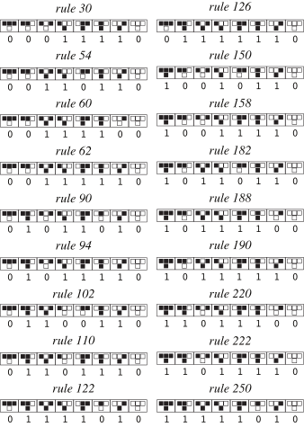

# セルラーオートマトン

セルラー オートマトン (CA) は、離散時間ステップで同じローカル ルールに従って同期的に更新される規則的なグリッド上の「セル」によって形成されるコンピューティング モデルです。その威力は、非常に単純なローカル更新が、ランダム性、構造、伝播、計算、本物のような動作などの驚くべきグローバルな複雑性を伴って出現する可能性があるという事実にあります。

- グリッドと次元: 1 次元、2 次元 (ライフ ゲームなど)、または高次元の規則的なグリッド ポイント。
- 状態セット: 通常、有限数の離散状態 (最も一般的にはバイナリ 0/1)。
- 近傍と範囲: 1 次元の 3 近傍 (自己 + 左右)、2 次元のフォン ノイマン/ムーア近傍など。
- 同期更新: すべてのセルは、各タイム ステップで同じルールを並行して適用します。

注: この図は、基本 (1D、バイナリ、3 近傍) ルール ファミリ内のさまざまなルールのローカル マッピングを示しています。小さな違いが、完全に異なるマクロ パターンにつながる可能性があります。

## なぜ重要なのでしょうか?

- 単純なものから複雑なものまで: 最小のコンポーネント (微分方程式よりも「原子的」) によっても、乱流、境界、粒子状構造、ランダム テクスチャなどの複雑なパターンが生成される可能性があります。
- 計算の多用途性: ルール 110 がチューリング完全であることが証明されている場合、CA は有効な計算を実行できます。
- 科学的方法論: 「計算の還元性」、「創発」、「複雑な世界を生成する単純なルール」を研究するためのテスト プラットフォームを提供します (「新しい科学」のトピックを参照)。

## 典型的なファミリーと用語

- 基本的な 1 次元 CA (基本 CA): 2 値、3 近傍 (前の行のトリプル → 現在の要素の次の状態)、合計 256 のルール (0 ～ 255)。
- 2 次元のライフ クラス (コンウェイのライフ ゲーム): ムーアの近隣 (8 つの近隣) に基づく「誕生/生存/死」ルールの家族。
- 近隣タイプ:
  - フォン ノイマン近傍: 十字形、マンハッタン距離 1。
  -ムーア近傍：3×3マス、チェビシェフ距離1。
- 行動分類 (Wolfram の 4 つのカテゴリ):
  - タイプ I: 均一性または固定点に向かう傾向があります。
  - カテゴリ II: 周期的/タイル状構造が発生します。
  - カテゴリ III: 無秩序、準ランダム (ルール 30 など)。
  - カテゴリ IV: 「局所構造」と相互作用は、秩序とカオスの間の境界に現れます (例: ルール 110)。

## 代表的な例

### ルール 30 (ルール 30)

ルール 30 は、最小限の設定で非常に不規則な三角形のテクスチャを生成します。右半分は強いランダム性を示しており、擬似ランダム ビットのソースとしてよく使用されます。

- 
- 
- インタラクティブなデモ: `demos/wolfram-rules-explorer/wolfram-rules-explorer.html`
- 拡張読み取り: `annotations/zh/rule-30.md`

### 規則 110 (規則 110)

ルール 110 は安定した「粒子」と相互作用を出現させることができ、チューリングは完了しています。

- 
- 

### 人生ゲーム

2 次元のライフ クラスでは、豊富な移動体 (グライダー)、銃 (グライダー キャノン)、発振器などが表示されます。

- 
- インタラクティブなデモンストレーション: `demos/chapter3/turing-machine-demo.html` (関連概念)、`demos/chapter3/chapter3-interactive.html`
- 拡張読み取り: `annotations/zh/conways-game-of-life.md`

## アプリケーションの概要

- 計算と複雑さ: チューリングの完全性、還元不可能性、予測不能性を示します。
- 自然現象: 結晶成長、反応拡散、相変化フロント、交通と拡散などの単純化モデル。
- アート生成: タイプ III/IV テクスチャを利用してパターンとアニメーションを生成します (`annotations/zh/computational-art.md` を参照)。