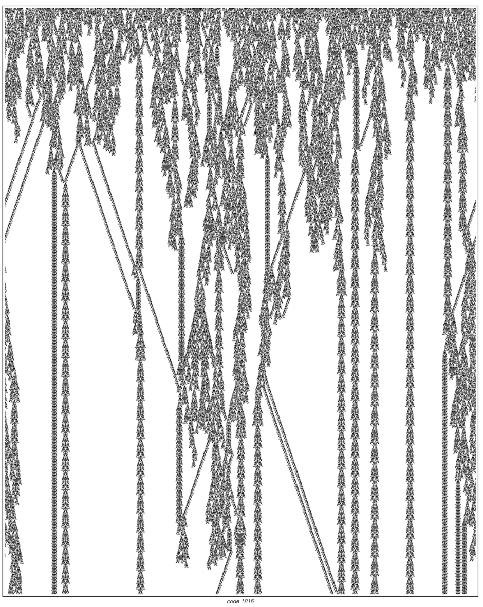
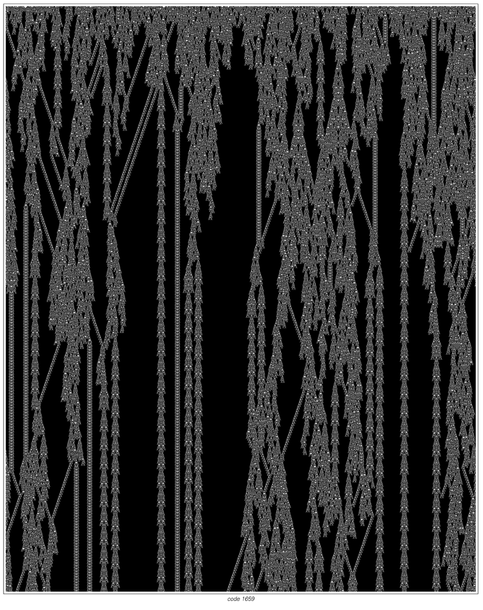
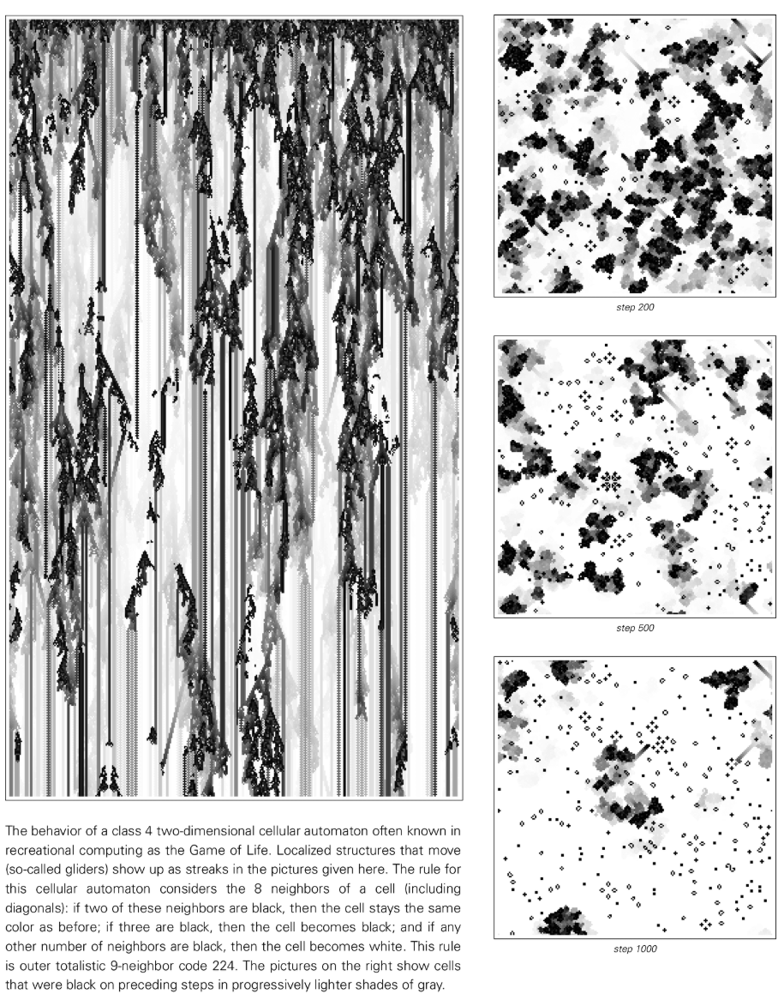

# カテゴリ 4 セルラー オートマトン

クラス 4 (Wolfram クラス IV) は、セル オートマトンにおける最も豊かで魅力的なタイプの動作を表します。このようなシステムは、安定した秩序と完全なランダム性の間の「複雑さの端」に位置し、長期持続する局所構造を伴って自発的に出現し、非常に複雑な相互作用を示します。

## 代表的な特性

- **局所構造**: 情報を移動し運ぶことができる持続可能な「粒子」または「グライダー」の形成。
- **複雑な相互作用**: 異なる構造が衝突すると、反射、吸収、分裂、または新しい構造の生成などの複数の反応が発生します。
- **混合背景**: 秩序とランダム性が共存し、背景には周期的または準周期的なテクスチャが含まれることがよくあります。

## はルールを表します

- **ルール 110**: チューリングが完了していることが証明されました。
- ルール 54、124、137 なども、複雑な相互作用と考えられる計算能力を示しています。

## 動的意味

- **計算の一般性**: 多くのカテゴリ 4 システムは、任意の計算をシミュレートする可能性があり、自然な計算と計算の既約性の研究の基礎となります。
- **情報伝達**: ローカル構造は「論理信号」とみなすことができ、それらの衝突により論理演算を実装できます。
- **重大な現象**: 多くの場合、カテゴリー 2 (周期的) とカテゴリー 3 (ランダム) の境界線の状態であると考えられます。

背景の詳細​​については、 [Four Classes Of Behavior](annotation:four-classes-of-behavior) および [Rule 110](annotation:rule-110) の詳細な説明を参照してください。