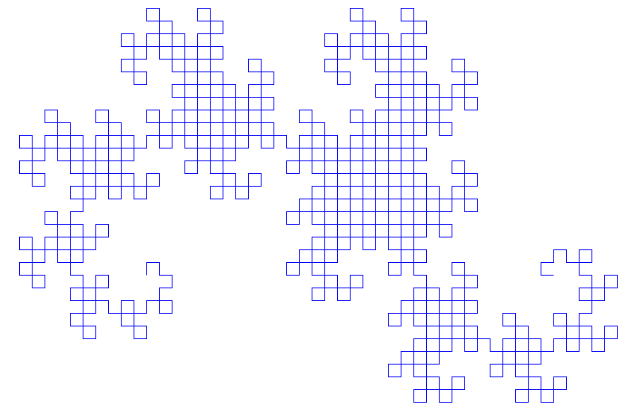

#コンピューテーショナル アートと美的美しさ

シンプルな計算ルールにより、自然を彷彿とさせると同時にユニークで独創的な、驚くべき美的性質を持つ画像を生成できます。これは、人間の直観だけでなく、計算による可能性の体系的な探求を通じて、芸術が創造される方法の根本的な変化を表しています。

## アートとしてのセルオートマトン

*ルール 110 セルラー オートマトンは、たった 3 つの単純なルールを使用して、視覚的に非常に複雑な美しい白黒パターンを作成します*

*つまようじシーケンスは、幾何学的な成長ルールが数学的精度と視覚的な魅力を備えたフラクタル パターンをどのように作成できるかを示しています*

*Conway のライフ ゲーム グライダー ガン パターン - たった 4 つの基本ルールで一貫してグライダーを生成し、無限の複雑さを生み出すシンプルな構成*

## フラクタルにおける数学の美しさ

*マンデルブロ集合は、単純な方程式 z² + c から無限の詳細と驚くべき視覚的複雑さを伴って出現し、数式がいかに深遠な美的体験を生み出すことができるかを示しています*

*再帰的細分化によって作成されたシェルピンスキー カーペット フラクタル - 中央の正方形を削除するという単純なルールから無限の複雑さが生まれます*

*L システム ルールによって生成されたドラゴンの形をした曲線フラクタル - 単純な再帰的折り命令によってエレガントな自己相似パターンを作成*

## コンピュテーショナル アートの特徴

### シンプルな起源、複雑な美しさ
- **最小限のルール**: 通常、コードまたは数式は数行だけです。
- **無限のバリエーション**: パラメーターの小さな変更により、まったく異なる美的効果が生まれます。
- **自然共鳴**: パターンは自然界に見られる形状 (貝殻、結晶、植物) をエコーすることがよくあります。
- **偶然の出現**: 美は明示的な美的プログラミングなしに出現します

### ユニークな視覚的特徴
- **自己相似性**: パターンは異なるスケールで繰り返されます
- **オーガニックな感触**: デジタル起源にもかかわらず、結果は多くの場合自然で生き生きと感じられます。
- **無限の詳細**: ズームインしてより微細な構造を明らかにします
- **ダイナミックな可能性**: 静止画像は動きと成長を示唆します

## アートアプリケーション

### デジタルメディア
- フラクタルアルゴリズムを使用したスクリーンセーバーと壁紙
- セルオートマトンの進化に基づいたインタラクティブデバイス
- 単純な数学的ルールに基づいた生成音楽の視覚化
- コンサートやパフォーマンスのためのリアルタイムパターン生成

### フィジカルアート
- セルオートマトンのルールに基づいたファブリックパターン
- フラクタル幾何学にインスピレーションを得た建築デザイン
- 数学的な成長パターンから導き出された彫刻の形
- アルゴリズムによる装飾を施したマスカスタマイズ製品

### デザインの革新
- フラクタル原理を使用したロゴデザイン
- 簡単なプログラムで生成されるテキスタイルパターン
- 計算上の美学を備えたユーザー インターフェイス要素
- アルゴリズムテクスチャを備えた製品表面

## 歴史的背景

### 従来型とコンピューティング型
- **古典芸術**: 人間の創造性、文化的表現、感情的な内容
- **コンピューテーショナル アート**: アルゴリズムの美しさ、数学的な精度、創発的な美学
- **合成**: 現代アーティストは人間の洞察力と計算能力を組み合わせます
- **新たな可能性**: 手動では探索できない美的領域

### 先駆者と開発
- 1960 年代から 70 年代の初期のコンピューター グラフィックス
- 1980年代のブノワ・マンデルブロによるフラクタル視覚化
- Stephen Wolfram のセルラー オートマトン パターン
- シンプルなルールを使用した現代的な生成アーティスト

## 哲学的な意味

### 美の本質
- **普遍原理**: 美には数学的根拠があるかもしれないという示唆
- **出現**: 自然のプロセスを反映した単純な起源から生じる複雑な美学
- **発見 vs. 創造**: アーティストは計算の可能性の探求者になる
- **客観性**: 人間の文化的背景に依存しない数学の美しさ

### 芸術的価値
- **創造性の再定義**: ルールを直接作成するのではなく、ルールを設計するスキル
- **真正性**: アルゴリズム アートにおける著作者性の問題について
- **独自性**: 単一のアルゴリズムが無限のバリエーションを生み出す可能性があります
- **意味**: 表現的な内容のない抽象的な美しさ

## 技術的根拠

### 鍵アルゴリズム
- **セルラー オートマトン**: グリッドベースのローカル ルールの進化
- **フラクタル生成**: 再帰的な数学関数
- **L システム**: 文法ベースの成長モデル
- **パーティクル システム**: 個人の行動から現れるパターン

### プログラミング方法
- **ルールベース**: 単純な対話ルールを定義します。
- **パラメータの探索**: 数学的定数の体系的な変化
- **ランダム要素**: パターン生成における制御されたチャンス
- **インタラクティブなデザイン**: アルゴリズムパラメータのリアルタイム操作

## 現代的な関連性

### デジタル時代のアート
- NFTとブロックチェーンベースのジェネレーティブアート
- ニューラルネットワークを使用したAI支援作成
- リアルタイム応答デバイス
- 仮想現実環境と拡張現実環境

### アクセシビリティ
- プログラミング ツールにより、プログラマー以外でもアルゴリズム アートにアクセスできるようになります
- クリエイティブな作品を共有し、共同作業するためのオンライン プラットフォーム
- プログラミングを通じてアートを教える教育プロジェクト
- オープンソース アルゴリズムにより計算上の創造性が民主化される

## 今後の方向性

### 新興テクノロジー
- 量子コンピューティングが新たな美的可能性を生み出す
- 生命システムを使用したアート生成バイオコンピューティング
- フラクタルおよびセルオートマトン構造の 3D プリント
- 仮想現実は没入型のアルゴリズム環境を実現します

### 芸術の進化
- 人間とAIのハイブリッドクリエイティブコラボレーション
- 環境データに応答するリアルタイム アダプティブ アート
- 生成原理の大規模なアーキテクチャへの応用
- パターン生成された治療および瞑想アプリケーション

## 文化的な影響

### 博物館とギャラリーの展示
- アルゴリズムアートを特集した大規模な展覧会
- 計算作品の永久コレクション
- 数学の美しさを学べるインタラクティブな展示
- アーティストと科学者のコラボレーション

### 教育アプリケーション
- 視覚的なパターン探索を通じて数学を教えます
- 芸術的動機を活用したプログラミング教育
- アートとコンピューターサイエンスを組み合わせた学際的なコース
- 複雑さと創発に対する国民の理解

コンピューテーショナル アートの探求により、審美的な美しさは特定の数学的構造の基本的な特性である可能性があり、単に文化的伝統を通じてではなく体系的な探究を通じてアクセスできることが明らかになりました。これは、創造性と美の性質についての深い疑問を提起すると同時に、芸術表現のまったく新しい領域を切り開きます。

## さらに読む

- [ジェネレーティブ アート (Wikipedia)](https://en.wikipedia.org/wiki/Generative_art)
- [アルゴリズムアート (Wikipedia)](https://en.wikipedia.org/wiki/Algorithmic_art)
- [コンピューター アート (Wikipedia)](https://en.wikipedia.org/wiki/Computer_art)
- [Wolfram デモンストレーション: アート ギャラリー](https://demonstrations.wolfram.com/topics.html?topic=Art)