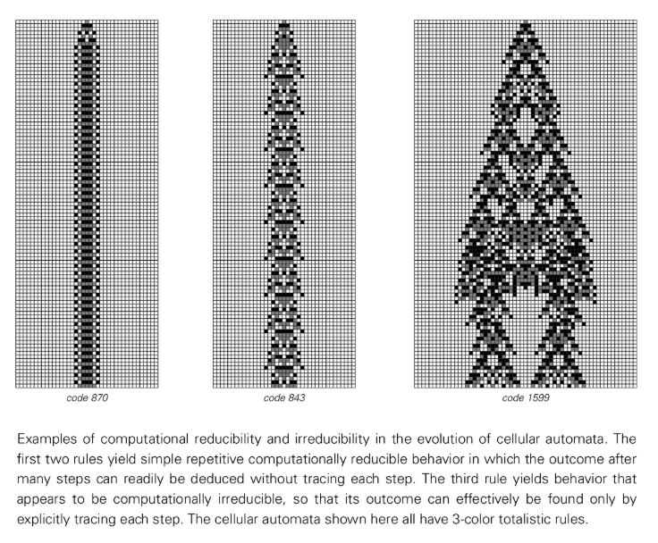

#既約性を計算する

計算の既約性は、スティーブン ウルフラムによって提案された基本的な概念であり、将来の動作を決定する唯一の方法が計算を段階的に明確に実行することであるシステムについて説明します。システムの自然な進化よりも早く結果を予測できる数学的近道や分析的解決策はありません。

## 定義と中心となる概念

システムが次の特性を持つ場合、そのシステムは計算的に既約です。
- **ショートカットはありません**: 結果を見つける唯一の方法は、各計算ステップを実行することです
- **予測には完全なシミュレーションが必要です**: すべての中間状態を計算せずに将来の状態にジャンプすることはできません
- **数学的分析の失敗**: 従来の分析手法ではより迅速な解決策を提供できません

*数学的な図解については、[計算既約性の例](https://mathworld.wolfram.com/ComputationalIrreducibility.html) を参照してください*

## 単純なシステムの例

### ルール 30 セルラー オートマトン
計算既約性の最も有名な例:
- ルールは単純ですが、複数のステップ後のパターンを予測するには、計算全体を実行する必要があります。
- 前のすべてのステップを計算せずにステップ n の状態を直接計算する数式はありません。
- 各細胞の進化は、分析ソリューションに抵抗する複雑な相互作用に依存します。

### その他の例
- **[三体問題](annotation:three-body-problem)**: 3 つ以上の天体の運動を予測するための解析的解決策はありません
- **タンパク質の折り畳み**: タンパク質の最終形状を決定するには、折り畳みプロセスをシミュレーションする必要があります。
- **気象システム**: 長期的な気象予測は計算の既約性によって制限されます

## 科学への影響

### 従来の数学の限界
計算の既約性は、数学的モデリングの基本的な限界を明らかにします。
- **方程式ベースのアプローチ**: 多くの自然現象は、解ける方程式では捉えることができません。
- **還元主義的分析**: システムを部分に分解すると、還元不可能な全体的な動作が見逃される可能性があります
- **予測力**: 自然の特定の側面は、短期間では本質的に予測不可能です。

### 新しい科学的手法
この概念は、次のことが必要であることを示唆しています。
- **計算実験**: 解析ソリューションではなく直接シミュレーション
- **パターン認識**: 方程式ではなく、出現した構造に焦点を当てます。
- **アルゴリズム的思考**: プロセスを数学的な関係ではなく計算として理解する

## 基礎物理学とのつながり

### 量子力学
計算上の既約性について考えられる説明:
- 量子測定がランダムに見える理由
- 量子力学における「測定問題」(https://en.wikipedia.org/wiki/Measurement_problem)
- 量子システムの予測可能性の限界

### 熱力学
[熱力学第二法則](https://en.wikipedia.org/wiki/Second_law_of_thermodynamics) に関連:
- 不可逆的なプロセスは計算的に還元できない可能性があります
- エントロピーの増加は計算の既約性を反映している可能性がある
- 統計力学は基礎となる既約計算から生まれます

## 計算量理論

### P と NP の関係
計算既約性は、[計算複雑性](https://en.wikipedia.org/wiki/Computational_complexity_ Theory) と関連していますが、異なります。
- **P vs NP**: 解決策を見つける難しさに焦点を当てる
- **計算の還元不可能性**: 計算能力に関係なく近道を見つけることが不可能であることに焦点を当てます。

### 決定不能性
[ゲーデルの不完全性定理](https://en.wikipedia.org/wiki/G%C3%B6del%27s_incompleteness_theorems) に関連:
- システムの動作に関するいくつかの質問は正式には決定不可能です
- 一部のシステムが停止するか永久に継続するかを判断できるアルゴリズムはありません

## 実際の結果

### 科学的モデリング
- **シミュレーションベースの科学**: 直接的な計算モデリングが主要なツールになります
- **創発現象**: 方程式の説明ではなく、出現するパターンに焦点を当てます。
- **予測の限界**: 予測の基本境界を受け入れます。

### テクノロジーと人工知能
- **機械学習**: 一部の AI の動作は計算的に還元できない可能性があります
- **アルゴリズム設計**: 既約システムを扱うために必要なメソッド
- **乱数生成**: ルール 30 は、まさに既約であるため使用されます。

## 哲学的な意味

### 自由意志と決定論
計算の既約性は中間点を提供します。
- システムは決定的であることもありますが、予測できないこともあります
- ルールが固定されていても、行動はランダムに見える
- 非決定的な自由意志を必要とせずに、人間の予測不能性を説明できる可能性がある

### 現実の性質
見せる：
- 宇宙は基本的に計算でできているのかもしれない
- 自然法則は還元不可能なアルゴリズムである可能性があります
- 現実は数学的に記述されるのではなく、計算される可能性があります

## さらに読む

- [計算既約性 (Wolfram Math World)](https://mathworld.wolfram.com/ComputationalIrreducibility.html)
- [決定できない問題](https://en.wikipedia.org/wiki/Undecidable_problem)
- [教会-チューリング論文](https://en.wikipedia.org/wiki/Church%E2%80%93Turing_thesis)