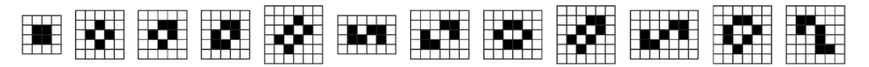
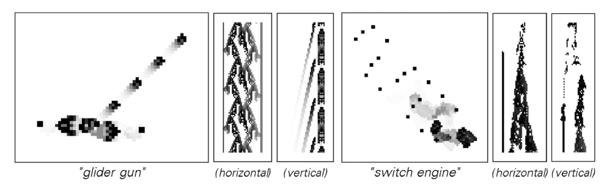

#コンウェイゲームオブライフ

「ライフ」とも呼ばれるライフ ゲームは、1970 年に数学者のジョン ホートン コンウェイによって作成された「ゼロプレイヤー ゲーム」です。これは、ゲームの進化は初期状態によって完全に決定され、プレイヤーからのさらなる入力は必要ないことを意味します。

ゲームはセルの 2 次元グリッドでプレイされ、各セルには「生きている」または「死んでいる」という 2 つの状態があります。次世代の各セルの状態は、次の 4 つの単純なルールに従って、周囲の 8 つの隣接セルの現在の状態によって決定されます。

1. **過疎**: 生きているセルに隣接するセルが 2 つ未満の場合、そのセルは死滅します。
2. **安定した生存**: 生きているセルに 2 つまたは 3 つの隣接セルがある場合、そのセルは次の世代まで生き残ります。
3. **過密**: 生きているセルに 3 つ以上の隣接セルがある場合、そのセルは死滅します。
4. **再生**: 死んだセルの周りにちょうど 3 つの生きたセルがある場合、それは生きたセルになります。

これらの単純なルールから、安定した「静物画」、繰り返しの「発振器」、有名な「グライダー」のようにグリッド上を移動する「宇宙船」など、多種多様で複雑で進化するパターンが生まれます。ライフ ゲームは、単純な初期状態とルールから膨大な複雑さがどのように生み出されるかを示す奥深い例であり、『A New Science』の中心テーマです。

## 歴史的背景と大衆文化

- 1970 年、マーティン ガードナーがサイエンティフィック アメリカンの「数学ゲーム」コラムで初めてライフ ゲームについて報告し、すぐに世界的な関心を呼び起こしました。
- ライフ ゲームは初期の「ハッカー文化」とパーソナル コンピューター コミュニティの象徴的な例となり、多くの愛好家がその進化をシミュレートするプログラムを作成しました。
- それは芸術、音楽、映画、文学の無数の創作にインスピレーションを与え、自己組織化と生命の出現の比喩を表しています。

## 典型的な構造

- **静物**: ブロック、ボート、蜂の巣など、これらのパターンは一度出現すると変更されません。

- **オシレーター**: 一定周期で繰り返すブリンカー、トード、パルサーなど。

- **宇宙船**: グライダー、軽量宇宙船 (LWSS) などがグリッド上を移動します。

- **グライダーガン**: ゴスパーグライダーガンやその他の構造物は、グライダーを継続的に生成して無制限に成長させることができます。

- **複雑なマシン**: グライダー、リフレクター、ロジック ゲートを組み合わせることで、人々はレジスター、カウンター、さらには完全なチューリング マシンを構築してきました。

## 計算の意味

- ライフ ゲームはチューリング完全であることが証明されており、理論的にはあらゆる計算プロセスをシミュレートできます。
- その進化は計算上の還元不可能性を反映しています。パターンの長期的な挙動について簡潔な予測を行うことは困難であり、段階的に計算する必要があります。
- 複雑なシステム、創発現象、人工生命を研究するための古典的なベンチマークとして、教育や実験で広く使用されています。

## リソースとツール

- [ConwayLife.com](https://www.conwaylife.com/): 多数のパターン ライブラリ、ディスカッション、ツールが含まれています。
- Golly や LifeViewer などのオープン ソース ソフトウェアは、ライフ ゲームとそのバリエーションを効率的にシミュレートできます。
- コンウェイの死後、研究者はより高速な宇宙船やよりコンパクトな普遍的な構造など、新しい構造の探索を続けました。