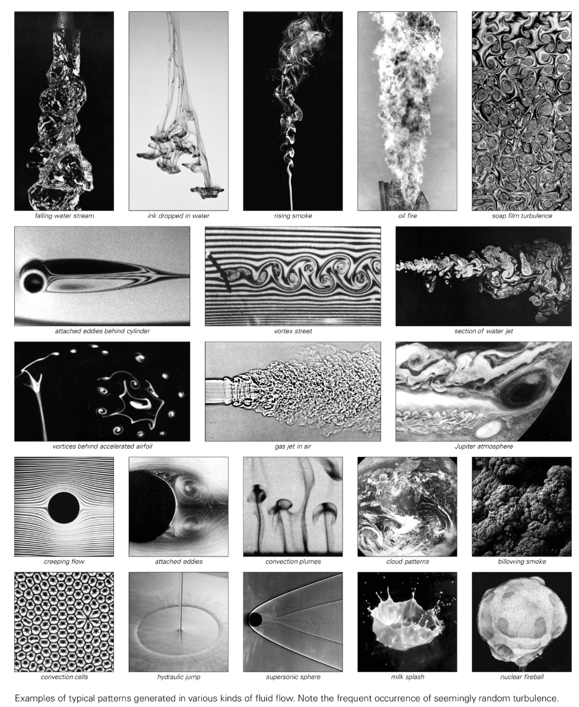

# 流体の流れ

流体の流れは、空間内の液体または気体の動きをカバーします。コアは、速度フィールド、圧力フィールド、およびそれらの時間の経過に伴う進化で構成されます。研究対象は層流、乱流、渦、衝撃波など様々な現象に及びます。

## 層流と乱流
- **層流**: 流線は平行で、せん断は小さく、通常は低レイノルズ数条件で発生します。
- **乱流**: 速度と圧力は時間と空間の高さとともに変動し、渦の注入とエネルギー カスケードを伴います。これは古典的な問題の 1 つです。

## 計算モデル
- **格子ガス/格子ボルツマン**: 離散グリッド上の単純な衝突ルールと伝播ルールを使用して、流体の巨視的挙動をシミュレートします。
- **セル オートマトン**: 離散粒子ルールを使用して、渦の通りや乱流の後流などの構造を生成し、「本質的なランダム性」を強調します。
- **偏微分方程式**: ナビエ・ストークス方程式は、連続媒体における運動量と質量の保存を記述し、伝統的な理論の基礎です。

## NKS の視点
- 単純なプログラム (格子ガス セル オートマトンなど) で層流から乱流への移行を再現でき、決定論的な規則によってランダム性が内生的に生成される可能性があることが明らかになります。
- 「連続現象」の議論を反映: 巨視的な滑らかな流れ場は、微視的な離散粒子によって平均化できます。

## 関連概念
- レイノルズ数
- ボルテックスとカルメンボルテックスストリート
- 計算の既約性（乱流の予測には段階的なシミュレーションが必要）

## さらに読む
- [流体力学 (Wikipedia)](https://en.wikipedia.org/wiki/Fluid_dynamics)
- [タービュランス (Wikipedia)](https://en.wikipedia.org/wiki/Turbulence)
- [格子ボルツマン法 (Wikipedia)](https://en.wikipedia.org/wiki/Lattice_Boltzmann_methods)