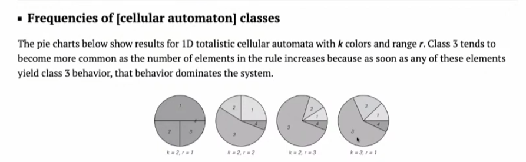

# 4 つの行動カテゴリー

『A New Science』の中心的な発見は、単純なプログラムの動作を観察すると、4 つの基本カテゴリのいずれかに分類される傾向があるということです。この分類は、コンピューティングの世界全体を理解するためのフレームワークを提供します。

## カテゴリ

**カテゴリ 1: 重複**
- **説明**: システムはすぐに安定して統合された状態になります。いくつかのステップを経ると、パターンは固定されるか、単純なサイクルで繰り返されます。
- **例え話**: 揺れが止まった振り子、または規則的な格子を形成する結晶。

**カテゴリー 2: ネスト**
- **説明**: システムは、構造がそれ自体のより大きなバージョン内にネストされている、規則的な自己相似パターンを生成します。これにより、多くの場合、複雑なフラクタルのような形状が生成されます。
- **例え話**: 枝分かれする木の枝、または雪の結晶の構造。

**カテゴリー 3: ランダム**
- **説明**: システムの動作は混沌としてランダムに見え、識別可能な順序や予測可能なパターンはありません。これは統計的なノイズに似ています。
- **例え話**: ガス中の分子、またはテレビ画面上の雪の結晶。

**カテゴリー 4: 複合体**
- **説明**: これは最も興味深いカテゴリです。このシステムは、秩序とランダム性の混合を生成します。移動し、相互作用し、時間の経過とともに持続するローカル構造があります。これらの構造は、相互作用しながらデータを伝達および変更する情報処理の原始的な形式とみなすことができます。
- **類推**: 生物内の複雑な相互作用、またはコンピューター内の情報の流れ。

＃＃ 意味

これら 4 つのカテゴリの存在は一般的な現象であり、さまざまなコンピューティング システムに現れます。カテゴリ 4 の動作の発見は、複雑な計算をサポートする能力が珍しいものでも壊れやすいものでもなく、コンピューティング世界の共通の特徴であることを示すため、特に重要です。これは、自然界の複雑さの起源を理解する上で深い意味を持ちます。