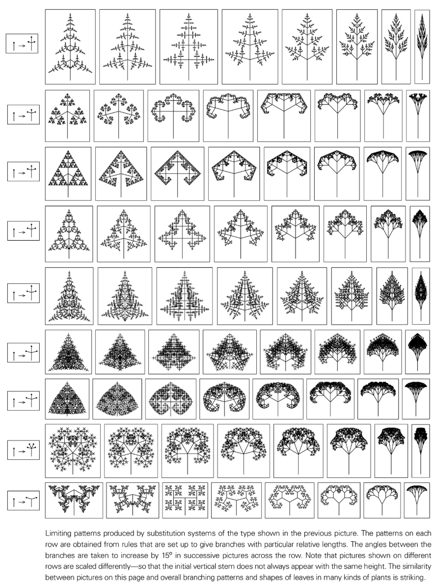
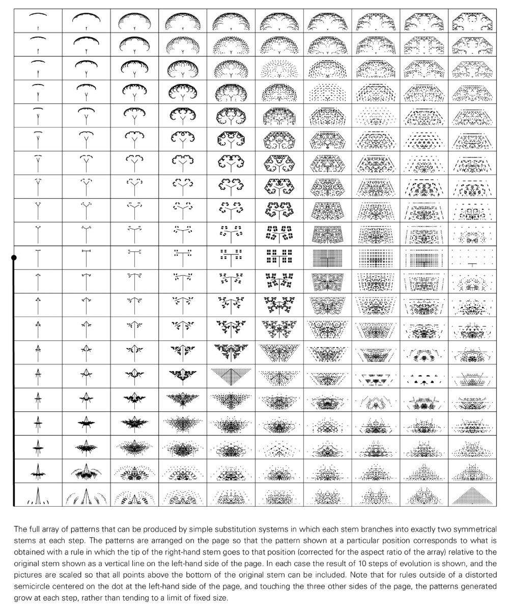

# 葉の形状の生成

葉の形態形成では、植物の葉が発生中に特定の幾何学的形状、分裂パターン、葉脈構造を形成するメカニズムを研究します。

## 重要な要素
- **成長率の勾配**: 葉のさまざまな領域における成長率の違いにより、カール、分岐、または先端の裂けが生じます。
- **生化学的パターン形成**: ホルモン (オーキシンなど) と転写因子は葉の表面に濃度パターンを形成し、細胞の分化を導きます。
- **機械的制約**: 組織の張力と弾性により、曲げや折り畳みが発生し、波状のエッジや折り目が形成されます。

## モデルとメソッド
- **置換ルールを備えた L システム**: ブレードの輪郭と静脈をプロシージャルに生成します。
- **反応拡散およびチューリングモデル**: ブレードリッジや静脈シーケンスなどのストライプ/スポット構造を説明します。
- **セル オートマトンと格子モデル**: ローカル ルールを通じて葉の成長と葉脈の拡張をシミュレートします。

## NKS の視点
- 単純なルール（局所置換、閾値決定など）により、バリエーション豊かな自然な葉の形状を生成できます。
- 「ローカル情報によって駆動される複雑な形式」と「固有のランダム性」の共存を示します。
- 自然な形の複雑さは、複雑な最適化目標がなければ現れる​​ことが多いことを示しています。

## さらに読む
- [葉の形 (Wikipedia)](https://en.wikipedia.org/wiki/Leaf_shape)
- [葉序 (Wikipedia)](https://en.wikipedia.org/wiki/Phyllotaxis)
- [L-system (Wikipedia)](https://en.wikipedia.org/wiki/L-system)