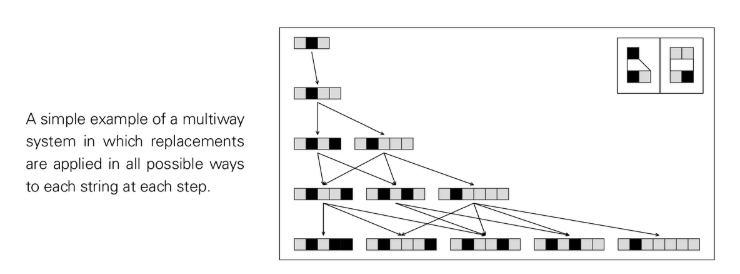

#マルチウェイシステム

マルチウェイ システムでは、実行可能なすべての置換/更新を各ステップで同時に実行できるため、並列の後続状態 (分岐) のクラスターが生成されます。これらの状態間の因果関係はネットワークとして見ることができます。異なる履歴パスが後続のステップで同じ状態に再収束する可能性があります。

## NKS の観点からの重要なポイント
- 独自の進化ではなく分岐: 単一経路進化のセルオートマトン/置換システムと比較して、「可能な歴史」の構造を明らかにします。
- 因果ネットワーク表現: それぞれの固有の状態をノードとして扱い、有向エッジを使用して「生産」関係を接続し、明確に視覚化された因果ジオメトリを取得します。
- 動作の 4 つのカテゴリは引き続き適用されます。状態セットのサイズと構造は、規則的な成長と繰り返しだけでなく、入れ子になったレベルやほぼランダムな複雑なパターンも示すことができます。
- パスの収束とマクロの一意性: 異なるパスが最終的に頻繁に収束する場合、大規模な「ほぼ一意な履歴」が存在する可能性があります。

## 代替/順次システムとの関係
- 逐次置換システム: 各ステップで 1 つの置換のみが行われます。マルチチャンネル システム: 各ステップで可能なすべての置換が行われ、重複が排除されます。
- どちらも、小さなルールセットの下で単純なものから複雑なものまであらゆる範囲の動作を提示でき、マルチパスの観点は「選択空間」の全体的な構造を強調します。

## 方法と観察の提案
- ルール スキャン: 各ステップ (線形、二次、指数関数) での状態数の増加と、長期または収束クラスターがあるかどうかをカウントします。
- ネットワーク メトリクス: 因果ネットワークのクリーク数、直径、クラスタリング、階層を追跡して、ネストされた領域とランダムな領域の共存を特定します。

## 外部参照 (概念)
- マルチウェイシステム (Wolfram関連情報)