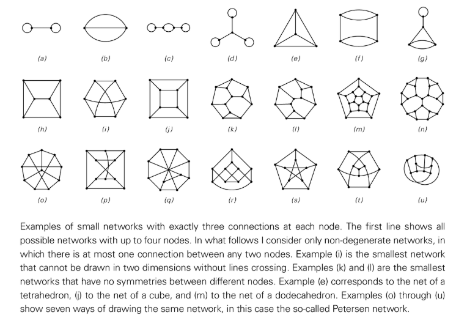

# ネットワークシステム

ネットワーク システムは、ノードと接続を使用して状態を記述し、グラフ、ハイパーグラフ、およびそれらの動的展開をカバーできる NKS のモデルです。

＃＃ 特徴
- **離散空間表現**: ノードは要素または「空間点」を表し、エッジ/ハイパーエッジは隣接関係を表します。
- **ルールの進化**: 特定のノード クラスターまたは接続パターンを置き換えてネットワークを更新し、複雑な形状を作成します。
- **因果構造**: イベントの依存関係を書き換えて因果ネットワークを形成することは、空間と時間を理解するための重要なツールです。

## 代表的な例
- Wolfram物理プロジェクトのハイパーグラフ置換ルール。
- 自己組織化トポロジと曲率は、単純なネットワーク置換によって実証されます。
- マルチパスシステムにおけるパス間の合流・分岐関係図。

## NKS協会
- 連続空間、保存量、物理法則が離散構造からどのように現れるかを説明します。
- 「因果不変性」や「計算上の既約性」などの中核となる概念を実証します。

## さらに読む
- S. Wolfram、*新しい種類の科学*、第 9 章
- [Wolfram物理学プロジェクト](https://www.wolframphysics.org/)