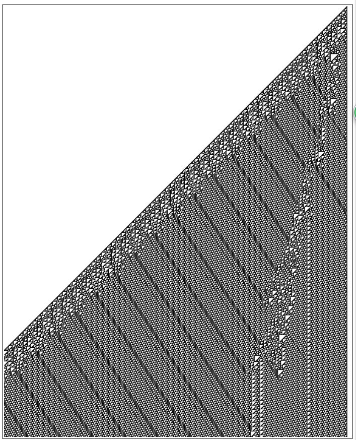
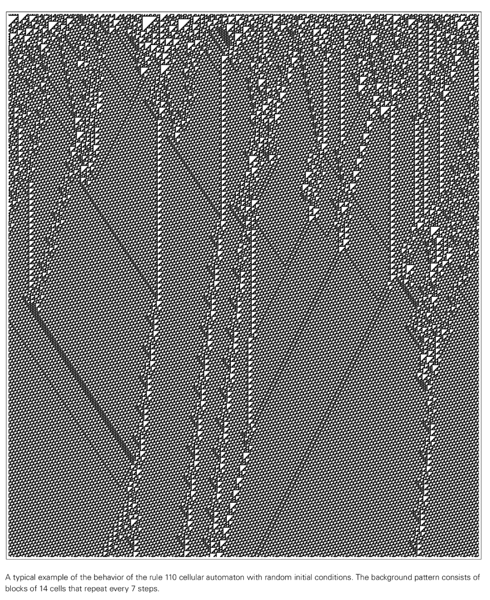

# ルール110

ルール 110 は、Stephen Wolfram による [Elementary Cellular Automata](https://en.wikipedia.org/wiki/Elementary_cellular_auTomaton) のもう 1 つの画期的な発見です。ルール 30 の混沌とし​​た複雑さとは異なり、ルール 110 は計算の一般性という驚くべき特性を示し、非常に単純なシステムでも任意の計算を実行できることを証明しています。

## ルール定義

ルール 110 はセルの 1 次元配列にも適用され、各セルは黒 (1) または白 (0) になります。このルールは、各セルの現在の状態とその 2 つのすぐ隣のセルの状態に基づいて、各セルの次の状態を決定します。

このルールは、単純なルックアップ テーブルとして表すことができます。
- 111 → 0
- 110→1
- 101 → 1
- 100 → 0
- 011→1
- 010→1
- 001→1
- 000 → 0

2 進表現 (01101110) は 10 進数の 110 に等しいため、「Rule 110」という名前が付けられています。

## 主な機能

### 計算の多様性
- **チューリング完全**: 任意のチューリング マシンをシミュレートし、任意の計算を実行できます。
- **ローカル構造**: 安定した「パーティクル」または「グライダー」構造を生成します。
- **背景パターン**: 周期性のある三角形の背景構造

### 構造挙動
- **安定した構造**: 一部の局所構造は静止したままです
- **移動構造物**: 一部の構造物は背景上を一定の速度で移動します。
- **衝突反応**: 構造が接触すると複雑な相互作用が発生します

## 視覚的なパターン

*ルール 110 は、単純な初期条件から発展して、複雑な局所構造と背景パターンを明らかにします*

*さらにステップを反復した後のルール 110 は、繰り返されたバックグラウンドでの安定した局所構造の相互作用を示しています*

*進化するパターンとルール 110 の局所構造を示す詳細なセル オートマトンの視覚化*

*構造間の複雑な相互作用を示すルール 110 の長期的な進化*

ルール 110 が実行されると、次のような複雑なパターンが生成されます。
- 正三角形の背景構造
- 背景上を移動するローカルの「パーティクル」
- 粒子が衝突するときに生じる複雑な相互作用

*ルール 110 の局所構造の詳細な相互作用。計算の一般性の基礎を示しています*

## 科学的意義

### コンピューティング理論のブレークスルー
ルール 110 の発見は、計算理論に大きな影響を与えました。
- **最小ユニバーサル システム**: 計算の普遍性が非常に単純なシステムで達成できることを示します。
- **ナチュラル コンピューティング**: 計算能力は自然システムの普遍的な特性である可能性があることを示唆しています
- **複雑度のしきい値**: 汎用の計算を生成するために必要な最小複雑度を決定します。

### 証明プロセス
マシュー・クックは、1994 年から 1998 年にかけてルール 110 の普遍性を実証しました。
- 循環ラベリングシステムをシミュレーションできる構造を構築
- これらの構造が論理演算を実行できることを実証しました
- 任意に複雑な計算回路を構築する方法を示します

## 他のシステムへの接続

ルール 110 は他のコンピューティング システムと深い関係があります。
- **チューリング マシン**: あらゆるチューリング マシンの計算をシミュレートできます。
- **セル オートマトン**: 256 個の基本セル オートマトンのうち、既知の 4 つの普遍的なタイプのうちの 1 つです。
- **自然システム**: 生物学的システムおよび物理システムにおける情報処理を理解するためのモデルを提供します。

## アプリケーションの見通し

### 理論の応用
- **計算の複雑さ**: 計算の一般性のための境界条件の研究
- **アルゴリズム設計**: 新しい並列コンピューティング アルゴリズムをインスピレーション
- **複雑性科学**: 複雑なシステムにおける情報処理メカニズムの理解

### 実際の応用
- **暗号**: 複雑なセル オートマトンに基づいた暗号化システムの設計
- **人工知能**: 新しいコンピューティング アーキテクチャの開発
- **材料科学**: 自己組織化および自己修復材料の挙動のモデル化

## さらに読む

- [マシュー・クックのルール 110 普遍性の証明](https://www.complex-systems.com/abstracts/v14_i05_a01/)
- [エレメンタリー・セルラー・オートマトン (Wikipedia)](https://en.wikipedia.org/wiki/Elementary_cellular_auTomaton)
- [ルール 110 (ウィキペディア)](https://en.wikipedia.org/wiki/Rule_110)
- [Wolframの「New Science」の関連章](https://www.wolframscience.com/nksonline/section-11.8)

