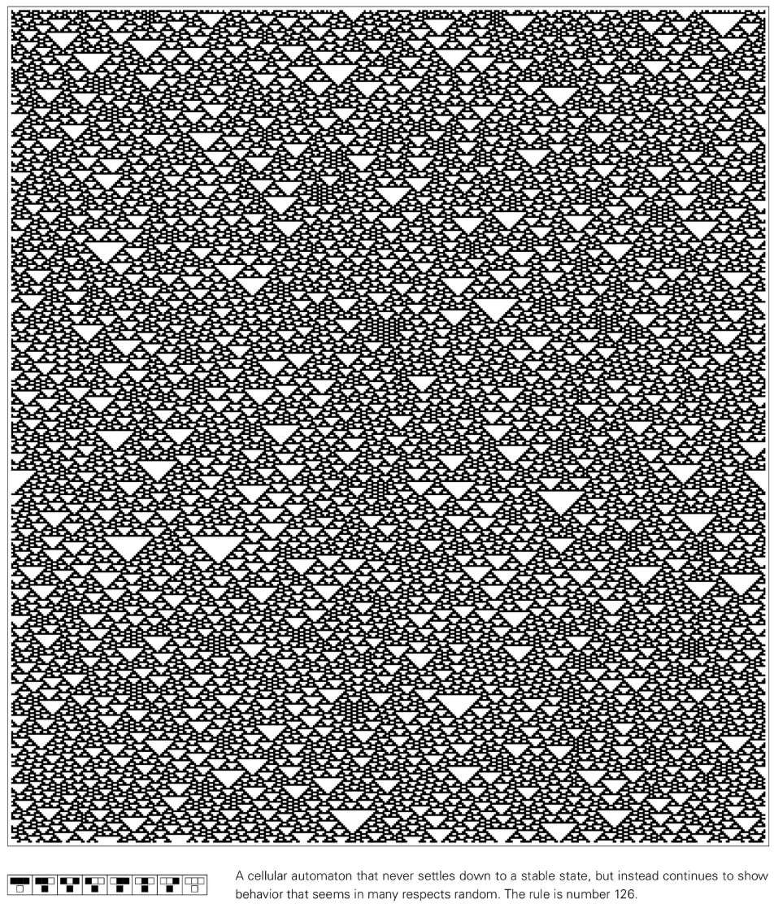
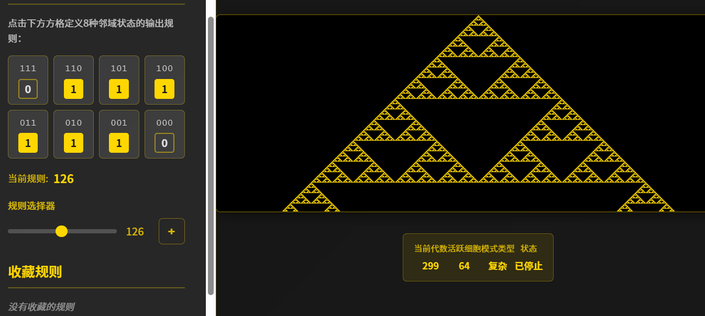

# ルール126

ルール 126 は、Stephen Wolfram によって提案された [Elementary Cellular Automata](https://en.wikipedia.org/wiki/Elementary_cellular_auTomaton) の 1 つです。これは、単純なルールから永続的なランダムな動作を生成することで知られており、自己組織化とランダム性の共存に関する重要なケーススタディです。

## ルール定義

ルール 126 は、各セルが黒 (1) または白 (0) の 2 つの状態を持つ、1 次元のセル配列に作用します。次のタイム ステップにおけるセルの状態は、セル自身とその 2 つの隣接セルの現在の状態の組み合わせによって決まります。

- 111 → 0
- 110→1
- 101 → 1
- 100→1
- 011→1
- 010→1
- 001→1
- 000 → 0

出力を 2 進数で 01111110 として読み取ると、10 進数値 126 が得られるため、「Rule 126」という名前が付けられます。

## 行動特性

- **連続的なランダム性**: 単一の黒いセルから開始する場合でも、ランダムな初期条件から開始する場合でも、進化はすぐに一見ランダムな構造で満たされます。
- **中空の三角形構造**: 白い細胞で構成される三角形の穴が濃い黒い背景に自然に現れます。これは認識ルール 126 の象徴的な特徴です。
- **高密度の背景**: ほとんどの局所的な組み合わせは黒の出力になるため、全体の濃度は常に黒に偏ります。
- **ローカル相関**: パターンはほぼランダムですが、短距離相関はローカルに保持されており、動作が完全にノイズが多いわけではないことを示しています。

## ダイナミクスと分類

- **Wolfram カテゴリ III**: 持続的な無秩序と混乱を示す「確率的」システムとして分類されるシステム。
- **初期条件に対する感度**: 小さな違いはすぐに増幅し、全体的なパターンはすぐに初期条件の認識性を失います。
- **非線形重ね合わせ**: ルール 90 などの加法性ルールとは異なり、ルール 126 の発展は初期状態の単純な重ね合わせとして表現できません。
- **アトラクター ネットワークは複雑です**: 状態空間を横断すると、アトラクターの数が膨大で、周期が非常に長いことが多いことがわかります。

## 研究の意義

- **ランダム性のソース**: 外部ノイズのない決定論的システムにおけるランダムな動作の古典的な例を提供します。
- **統計物理モデル**: 密度変動、相関関数、非平衡定常状態などの統計的特性を調査するために使用されます。
- **情報拡散**: 進化の過程で、情報は急速に全世界に拡散し、不可逆性や計算の還元性を研究する材料となります。

## さらに読む

- [エレメンタリー・セルラー・オートマトン (Wikipedia)](https://en.wikipedia.org/wiki/Elementary_cellular_auTomaton)
- [ルール 126 (Wolfram MathWorld)](https://mathworld.wolfram.com/Rule126.html)
- [「A New Science」における確率的初期条件に関する議論](https://www.wolframscience.com/nksonline/section-6.2)