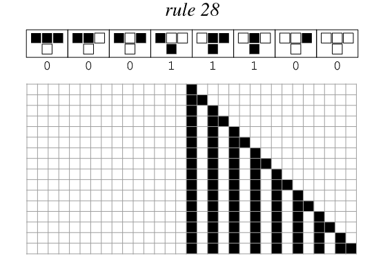

# ルール28

ルール28はWolframの基本セルオートマトンの一部であり，一般に分類学的にはカテゴリー2（周期的/入れ子）に分類される。その進化するパターンは、明確な三角形の入れ子構造と局所的な周期性を示しており、単純なルールで予測可能でありながらフラクタル風味のパターンをどのように生成できるかを示す典型的な例です。以下の詳細は MathWorld のページの説明に基づいています。

## ルール定義

ルール 28 は 1 次元のバイナリ セル オートマトンに作用します。ローカル更新は、セル自体とその左右の 2 つの隣接セルのステータスに依存します。更新テーブルは次のとおりです。

- 111 → 0
- 110 → 0
- 101 → 0
- 100→1
- 011→1
- 010→1
- 001 → 0
- 000 → 0

出力はバイナリ シーケンス `00011100` として読み取られます。これは 10 進数の 28 であるため、「Rule 28」という名前が付けられています。

## 行動特性

- **三角形の入れ子構造**: 単一の黒いセルから開始すると、パターンはシェルピンスキー三角形に似た積層構造に右に拡張されますが、左側の静的な背景は維持されます。
- **局所周期性**: ランダムな初期条件下では、システムはカテゴリ 2 に典型的な、周期的なストライプと入れ子になった三角形の組み合わせ構造にすぐに収束する傾向があります。
- **対称**: ルール 90 によって生成される対称的なネスト パターンと比較して、ルール 28 のネストは片側に偏る傾向があり、更新テーブルの左右の隣接要素の処理における非対称性を反映しています。
- **アトラクターの規模が限られている**: 進化したパターンは最終的に有限周期サイクルまたは静的ブロック構造に入り、情報伝達の範囲は制限されます。

## 数学的性質と観察

- **ミラー相関**: そのミラー、補完、およびミラー補完ルールは、それぞれルール 70、199、および 157 に対応します。単一の黒セルの初期状態の場合、これはルール 156 と同等です。これは、両方のバイナリ真理値表が `x0011100₂` 形式に属しているためです (`x` は 0 または 1 であり、ルール 28 と 156 の最大ビットの差に対応します)。
- **対称操作**: ルール 156 は依然としてミラーおよび補完操作の下でそれ自体を反映しており (ミラー補完ルールは依然として 156)、このタイプのルールの対称分解を示しています。
- **ヤコブスタール数列の接続**: 単一の黒いセルから開始して、第 n 世代のバイナリ パターンは、ヤコブスタール数列 (1、3、5、11、21、…; OEIS A001045) をバイナリで書き込み、先頭のゼロを削除して (1、11、101、1011、…; OEIS A070909) を取得することによって取得できます。したがって、この初期条件下での発展は「還元可能」です。対応するヤコブスタール数を直接計算し、その 2 進展開を行うことができます。
- **非加法性**: ルール 28 は、最初のフラグメントの重ね合わせからグローバル パターンを予測する単純な XOR または線形ルールではありません。
- **関連カテゴリ**: Wolframの4カテゴリフレームワークでは，ルール4およびルール12とともに「循環/入れ子」行動グループに属し，比較研究の対象として使用できる。

## さらに読む

- [ルール 28 — Wolfram MathWorld](https://mathworld.wolfram.com/Rule28.html)
- Wolfram によるカテゴリー 2 の行動に関する議論 (『A New Science』を参照) (55、90 ページを参照)
- [初級セルオートマトン](https://mathworld.wolfram.com/ElementaryCellularAutomaton.html)