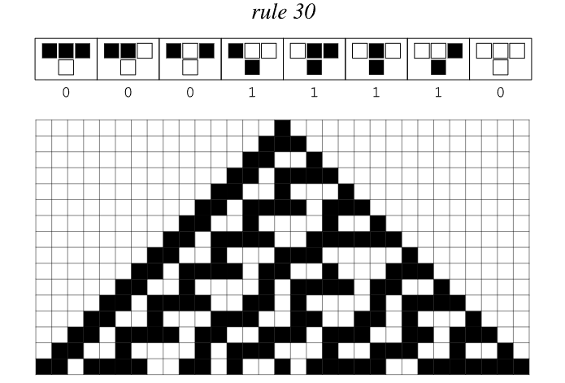

# ルール 30

ルール 30 は、Stephen Wolfram によって発見された最も有名な [Elementary Cellular Automata](https://en.wikipedia.org/wiki/Elementary_cellular_auTomaton) の 1 つです。非常に単純なルール構造にもかかわらず、複雑で一見ランダムなパターンが生成され、単純さから複雑さがどのように生まれるかについての私たちの理解に革命をもたらします。

## ルール定義

ルール 30 はセルの 1 次元配列に作用し、各セルは黒 (1) または白 (0) になります。このルールは、各セルの現在の状態とその 2 つのすぐ隣のセルの状態に基づいて、各セルの次の状態を決定します。

*単一の黒セルからのルール 30 の初期の進化。特徴的なネスト パターンと新たな複雑性が示されています*

*ルール 30 の詳細な進化。単純なルールから生じる複雑なランダム性を示しています*

*ルール 30 はさらに多くの段階を経て進化し、引き続き複雑さとランダム性を示しました*

*500 回反復後のルール 30 は、単純な初期条件から生じる完全な複雑さを示しています*

このルールは、単純なルックアップ テーブルとして表すことができます。
- 111 → 0
- 110 → 0
- 101 → 0
- 100→1
- 011→1
- 010→1
- 001→1
- 000 → 0

2 進表現 (00011110) は 10 進数の 30 に等しいため、「ルール 30」という名前が付けられます。

## 主な機能

### シンプルさから複雑さが生まれる
- **ローカルの単純さ**: セルごとに 3 つの近傍のみが考慮されます
- **グローバルな複雑さ**: 一見ランダムに見える複雑なパターンを生成します
- **確実性**: ランダムに見えても、すべてのステップは完全に決定的です

### 計算特性
- **既約性**: 完全な計算を実行せずに単純化または予測することはできません。
- **初期条件に敏感**: 開始設定の小さな変更が大幅に異なる結果につながります
- **擬似乱数生成**: Mathematica の乱数生成器で使用されます

## 視覚的なパターン

*ルール 30 の進化するパターンと構造を示す詳細なセル オートマトンの視覚化*

ルール 30 が単純な初期条件 (通常は単一の黒いセル) から実行されると、次の三角形パターンが生成されます。
- 中央尾根の複雑な入れ子構造
- ネストされた三角形パターンの左側を表示します
- 完全にランダムに見える右側

## 科学的意義

### パラダイムシフト
ルール 30 は科学における基本的な仮定に疑問を投げかけます。
- 単純なルールは必然的に単純な行動につながるという概念を覆します
- 明らかなランダム性が決定論的なプロセスから生じる可能性があることを実証
- 単純なコンピューティング システムには複雑さが遍在していることを示しています

＃＃＃ 応用
- **暗号**: 擬似ランダムシーケンスの生成に使用されます。
- **コンピューター サイエンス**: 並列コンピューティングとアルゴリズム分析のモデル
- **物理学**: [カオス システム](https://en.wikipedia.org/wiki/Chaos_ Theory) および [統計力学](https://en.wikipedia.org/wiki/Statistical_mechanics) についての洞察を提供します。
- **生物学**: 自然システムにおけるパターン形成の理解に役立ちます

## 自然とのつながり

ルール 30 のパターンは、次の現象と非常によく似ています。
- 軟体動物の殻のパターン
- 動物の色素沈着パターン
- 流体の乱流
- 結晶成長パターン

これは、同様の単純な規則が自然全体のパターン形成の基礎となっている可能性があることを示唆しています。

## さらに読む

- [1983 年の Wolfram のオリジナル論文](https://www.stephenwolfram.com/publications/cular-automata-irreversibility-randomness/)
- [エレメンタリー・セルラー・オートマトン (Wikipedia)](https://en.wikipedia.org/wiki/Elementary_cellular_auTomaton)
- [ルール 30 (Wikipedia)](https://en.wikipedia.org/wiki/Rule_30)