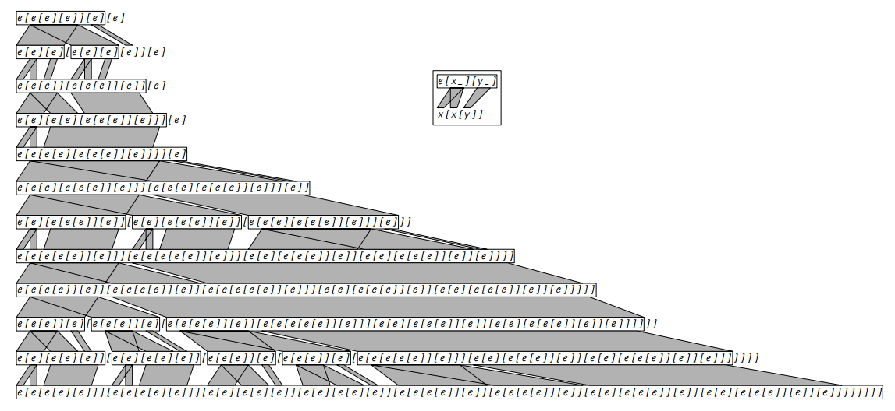

# シンボル体系

シンボリック システムは、数値や色付きのセルではなく、シンボリック式を操作する計算システムです。これらのシステムは、Mathematica のようなコンピューター代数システムの中核機能からインスピレーションを得ています。

## 動作原理

シンボリック式は、`f[g[x]]` や `a[b][c]` などの入れ子構造です。シンボル体系は、変換ルールを繰り返し適用することで、これらの式を操作します。

1. **式**: システムは最初の記号式から始まります。
2. **ルール**: パターンを置き換える方法を指定する変換ルールを定義します。簡単な例は `e[x_][y_] → x[x[y]]` です。このルールは、「パターン `e[x][y]` に一致する式の一部を見つけて、それを `x[x[y]]` に置き換える」ことを意味します。
3. **変換**: システムは式をスキャンし、パターンが見つかった場所にルールを適用します。

＃＃ 意味

シンボル システムは、非常に一般的な計算形式を表します。剛直な基礎構造 (セルのグリッドや紙テープ) を持つセル オートマトンやチューリング マシンとは異なり、シンボリック システムは柔軟なツリー状のデータ構造で動作します。

これらのシステムを研究することにより、Wolfram はこの高度に抽象的で一般的な領域においても計算上の等価性の原則が成り立つことを実証しました。単純な初期式に単純な変換ルールを適用すると、非常に複雑な動作が発生する可能性があります。これは、複雑さの現象が特定の種類のシステム (グリッドなど) に起因するものではなく、すべてのコンピューティングの真の基本的な機能であることを示しています。