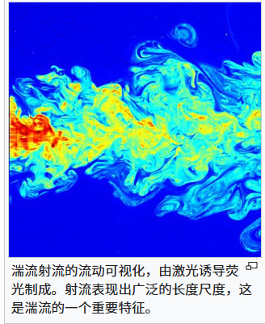

# 乱気流

乱流とは、高レイノルズ数条件下での流体の非常に不規則でカオスな状態を指します。これは、時間と空間における速度と圧力の急速な変動を特徴とし、一連の渦とスケールを越えたエネルギー カスケードを形成します。

## 主な機能
- **高レイノルズ数**: 慣性力が粘性力を圧倒し、層流が不安定になり乱流に入ります。
- **マルチスケール構造**: 大規模な渦が小規模な渦に分裂し続け、エネルギー カスケードを形成します。
- **統計的説明**: 過渡状態は予測が難しく、平均速度、乱流強度、スペクトル関数などの統計によってのみ特徴付けることができます。
- **散逸と混合**: 乱流は、運動量、熱、物質の混合と散逸効率を大幅に高めます。

## NKS の視点
- 単純なローカルルールは複数のスケールで複雑なテクスチャを生成することができ、乱流のマルチレベル渦構造が単純な手続きモデルによって特徴付けられる可能性があることを示唆しています。
- 計算の非還元性とは、乱流の展開を閉じた定式化では迅速に予測できないことを意味し、多くの場合、段階的なシミュレーションが唯一の手段となります。
- マルチパス システムと乱気流はどちらも「パス爆発」現象を示します。局所的な小さな差異は時間の経過とともに急速に増幅します。

## 関連概念
- レイノルズ数
- ナビエ・ストークス方程式
- 統計流体力学

## さらに読む
- [タービュランス (Wikipedia)](https://en.wikipedia.org/wiki/Turbulence)
- S. Wolfram、*新しい種類の科学*、第 9 章