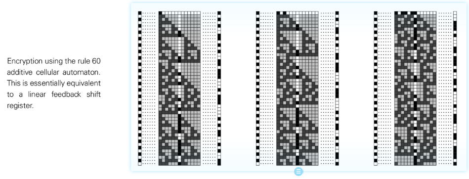

# 可加性细胞自动机

可加性细胞自动机（Additive Cellular Automata）是一类规则可写成线性（模 2 等）加和形式的元胞自动机，例如规则 60、规则 90 等。其核心特征是下一状态为邻域状态的可加组合，常可用线性代数工具分析。

## 特点
- **线性性**：更新可写为邻居状态的线性组合（布尔加法 / XOR）。
- **可解析性**：行为可通过矩阵、傅里叶方法预测，通常难以产生真正不可预测的复杂性。
- **嵌套图案**：常生成分形或对称结构（如谢尔宾斯基三角），适合作为展示简单规则→复杂结构的示例。

## NKS 关联
- 作为类别 2/3 边界案例，帮助对比线性规则与非线性规则的复杂性差异。
- 在密码分析中易被破解，强调需避免使用可加性规则生成随机性。

## 延伸阅读
- S. Wolfram, *A New Kind of Science*, Chapter 3 & 6
- [Additive cellular automaton（维基百科）](https://en.wikipedia.org/wiki/Additive_cellular_automaton)
