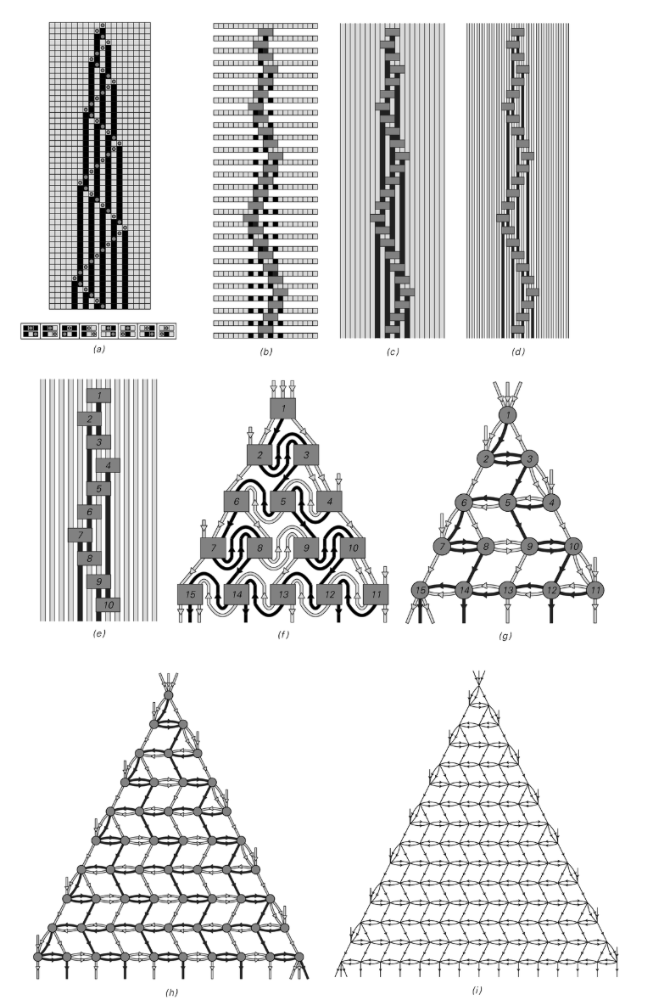

# 因果网络

因果网络（Causal Network）记录计算或物理过程中事件之间的因果关系：每个节点代表一次更新事件，定向边表示“前因产生后果”。

## 关键概念
- **事件图谱**：抽象掉系统具体状态，仅保留事件及其因果顺序。
- **时间箭头**：沿有向边的拓扑顺序给出内部观察者感知的时间流逝。
- **时空切片**：选择不同的等价“切片”可对应不同惯性系或观察视角。

## 在 NKS 中的作用
- **移动/替换系统**：从异步局部更新构建全球因果网络，理解无全局时钟的演化。
- **因果不变性**：若不同更新顺序生成同一因果网络，则对应相对论中的普适物理定律。
- **物理建模**：为从离散规则涌现连续时空几何、光速限制等现象提供框架。

## 延伸阅读
- S. Wolfram, *A New Kind of Science*, Chapter 9
- [Wolfram Physics Project](https://www.wolframphysics.org/)
