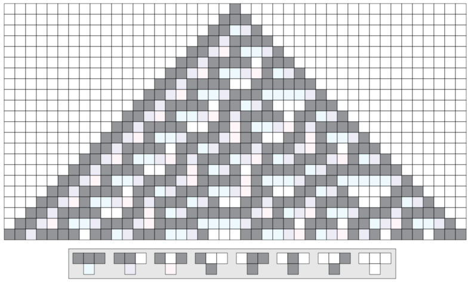
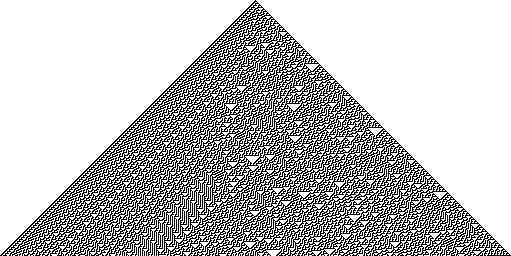
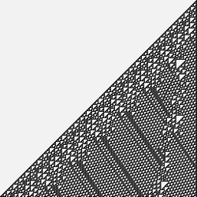

# 元胞自动机分类

斯蒂芬·沃尔夫拉姆对元胞自动机的系统探索导致了一个基本分类方案，该方案将所有可能的元胞自动机行为组织成四个不同的类别。这种分类为理解计算和自然系统提供了一个通用框架。

## 四个类别

### I类：均匀（死亡）
**行为**：演化导致均匀、稳定状态
- **特征**：所有单元格最终达到相同状态（全黑或全白）
- **图案**：同质的最终配置
- **例子**：规则0、8、32、40、128、136、160、168
- **自然类比**：达到热平衡的系统

*参见[基本元胞自动机例子](https://mathworld.wolfram.com/ElementaryCellularAutomaton.html)查看I类行为*

**典型行为**：
- 短暂的初始活动
- 快速收敛到均匀状态
- 没有持续结构

### II类：周期（秩序）
**行为**：演化导致简单的周期结构
- **特征**：出现规律的、重复的图案
- **图案**：简单的周期或嵌套结构
- **例子**：规则4、12、36、44、132、140、164、172
- **自然类比**：晶体、规律的生物图案

**典型行为**：
- 形成稳定的、重复图案
- 简单的周期振荡
- 可预测的长期行为

### III类：混沌（随机性）
**行为**：演化导致混沌的、看似随机的图案
- **特征**：看似随机的、非周期行为
- **图案**：没有可辨识的规律性或重复
- **例子**：规则18、22、30、46、134、146、150、182
- **自然类比**：湍流流体、天气系统

*参见[规则30例子](https://en.wikipedia.org/wiki/Rule_30)查看III类混沌行为*

**典型行为**：
- 不规则、不可预测的图案
- 对初始条件敏感依赖
- 统计而非确定性可预测性

### IV类：复杂（混沌边缘）
**行为**：演化导致复杂的局部结构
- **特征**：规律和不规律行为的混合
- **图案**：局部结构、滑翔子、复杂相互作用
- **例子**：规则54、110、124、137
- **自然类比**：生命系统、计算、意识

*参见[规则110例子](https://en.wikipedia.org/wiki/Rule_110)查看IV类复杂行为*

**典型行为**：
- 形成持续的局部结构
- 结构之间的复杂相互作用
- 能够进行通用计算

## 普遍模式

### 跨系统适用性
四类方案出现在不同的系统中：
- **神经网络**：类似的行为类别
- **经济系统**：收敛、周期、混沌、复杂性
- **生态模型**：显示所有四类的种群动力学
- **物理系统**：不同类别之间的相变

### 数学基础
每个类别对应不同类型的数学行为：
- **I类**：不动点吸引子
- **II类**：极限环吸引子
- **III类**：奇异吸引子、混沌
- **IV类**：临界现象、混沌边缘

## IV类的特殊性质

### 计算普遍性
IV类系统特别重要：
- **图灵完备性**：可以执行任何计算
- **信息处理**：可以存储和操作信息
- **图案形成**：生成复杂的、有组织的结构

### 规则110作为通用计算机
沃尔夫拉姆证明了[规则110](https://en.wikipedia.org/wiki/Rule_110)是图灵完备的：
- 可以模拟任何计算机程序
- 证明了基本元胞自动机中的普遍性
- 显示了简单规则可以支持复杂计算

### 生物学相关性
IV类行为类似于生命系统：
- **自组织**：复杂结构的自发形成
- **适应**：响应环境变化的能力
- **信息处理**：信息的存储和传输
- **进化**：随时间产生增加的复杂性

## 相变

### 类别之间
系统可以表现出类别之间的转变：
- **参数变化**：轻微的规则修改可以改变类别行为
- **临界点**：特定参数值处的急剧转变
- **普遍性**：不同系统中类似的转变模式

### 混沌边缘
II类（秩序）和III类（混沌）之间的边界：
- **最大复杂性**：IV类经常出现在这个边界
- **最优计算**：混沌边缘处的最佳信息处理
- **自然选择**：进化可能驱动系统朝向这个临界区域

## 对科学的影响

### 复杂系统理论
分类为理解以下内容提供框架：
- **涌现**：复杂行为如何从简单规则产生
- **自组织**：自发的图案形成
- **临界性**：秩序和混沌之间的系统

### 计算理论
揭示基本原理：
- **自然界中的计算**：自然系统可能在进行计算
- **普遍性**：简单系统可以像任何计算机一样强大
- **复杂性的涌现**：从基本规则产生的复杂性

### 生物学应用

#### 进化和发育
- **形态发生**：发育生物体中的图案形成
- **基因调控网络**：基因表达动力学
- **种群遗传学**：遗传频率的进化

#### 神经科学
- **大脑动力学**：显示所有四类的神经网络行为
- **意识**：可能从IV类型动力学中涌现
- **学习**：信息处理和记忆形成

## 方法论意义

### 系统探索
沃尔夫拉姆的方法展示：
- **全面枚举**：系统地研究所有可能的规则
- **模式识别**：识别普遍的行为类别
- **计算实验**：用计算机探索数学可能性

### 新的科学方法
分类表明：
- **基于规则的建模**：关注简单规则而不是复杂方程
- **计算探索**：规则系统的直接实验
- **普遍原理**：在不同系统中寻找共同模式

## 延伸阅读

- [基本元胞自动机（维基百科）](https://en.wikipedia.org/wiki/Elementary_cellular_automaton)
- [规则110（维基百科）](https://en.wikipedia.org/wiki/Rule_110)
- [沃尔夫拉姆1984年关于分类的原始论文](https://www.stephenwolfram.com/publications/cellular-automata-irreversibility-randomness/)
- [复杂系统理论](https://en.wikipedia.org/wiki/Complex_system)