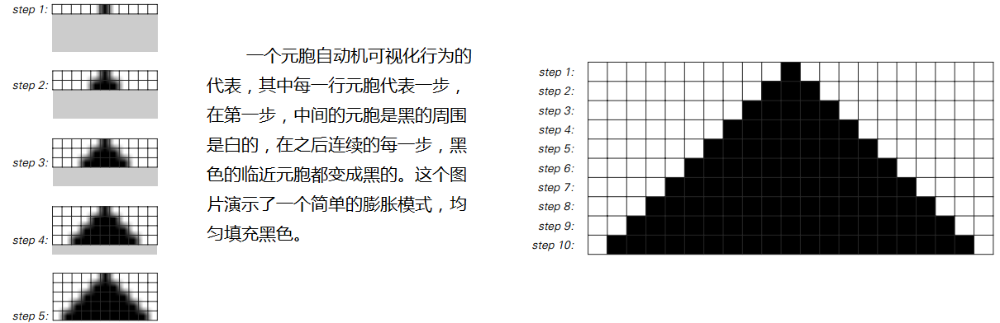
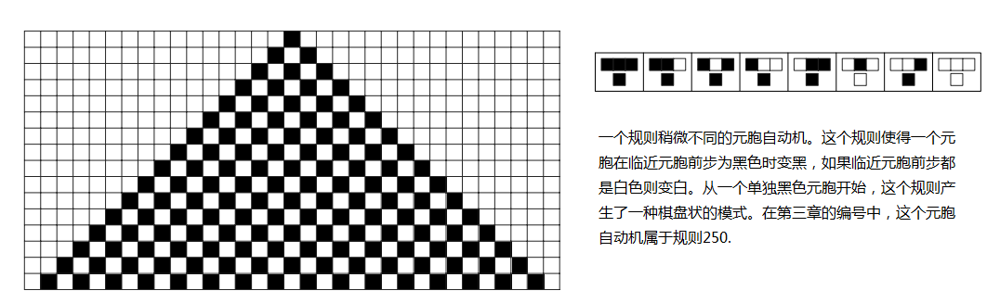
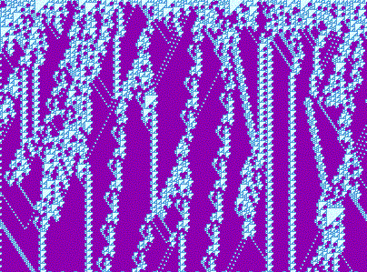

# 细胞自动机（Cellular Automata）

细胞自动机（CA）是由规则网格上的“细胞”在离散时间步按同一局部规则同步更新而形成的计算模型。其力量在于：极其简单的局部更新可以涌现出惊人的全局复杂性，包括随机性、结构、传播、计算与生命般的行为。

- 网格与维度：一维、二维（如生命游戏）、或更高维规则格点。
- 状态集合：通常是有限个离散状态（最常见为二值 0/1）。
- 邻域与范围：如一维的三邻域（自身+左右），二维的冯·诺依曼/摩尔邻域等。
- 同步更新：所有细胞在每一时间步并行应用相同规则。

注：图示展示了基本（1D、二值、三邻域）规则族中不同规则的局部映射，微小差异即可导致全然不同的宏观图案。

## 为什么重要

- 从简单到复杂：最小成分（比微分方程还“原子化”）也能产生湍流、边界、粒子样结构、随机纹理等复杂模式。
- 计算通用性：如规则110已被证明图灵完备，CA可实现任意有效计算。
- 科学方法学：为研究“计算不可约性”“涌现”“简单规则生成复杂世界”提供试验平台（参见《一种新科学》主题）。

## 典型家族与术语

- 基本一维CA（Elementary CA）：二值、三邻域（上一行的三元组→当前元的下一状态），共有 256 条规则（0–255）。
- 二维生命类（Conway’s Game of Life）：基于摩尔邻域（8邻居）的“出生/存活/死亡”规则族。
- 邻域类型：
  - 冯·诺依曼邻域：十字形，曼哈顿距离1。
  - 摩尔邻域：3×3 方块，切比雪夫距离1。
- 行为分类（沃尔夫拉姆四类）：
  - I 类：趋于同质或固定点。
  - II 类：出现周期/平铺结构。
  - III 类：紊乱、类随机（如规则30）。
  - IV 类：边界上出现“局部结构”与相互作用，介于秩序与混沌之间（如规则110）。

## 代表性例子

### 规则30（Rule 30）

规则30在极简设定下生成高度不规则的三角纹理，右半部分呈现强随机性，常被用作伪随机位的来源：

- 
- 
- 交互演示：`demos/wolfram-rules-explorer/wolfram-rules-explorer.html`
- 延伸阅读：`annotations/zh/rule-30.md`

### 规则110（Rule 110）

规则110能涌现稳定的“粒子”与相互作用，且图灵完备：

- 
- 

### 生命游戏（Game of Life）

二维生命类展示丰富的移动体（滑翔机）、枪（滑翔机炮）、振荡子等：

- 
- 交互演示：`demos/chapter3/turing-machine-demo.html`（相关概念）、`demos/chapter3/chapter3-interactive.html`
- 延伸阅读：`annotations/zh/conways-game-of-life.md`

## 应用快览

- 计算与复杂性：演示图灵完备、不可约性与不可预测性。
- 自然现象：晶体生长、反应扩散、相变前沿、交通与扩散等简化模型。
- 艺术生成：利用 III 类/IV 类纹理生成图案与动画（见 `annotations/zh/computational-art.md`）。
