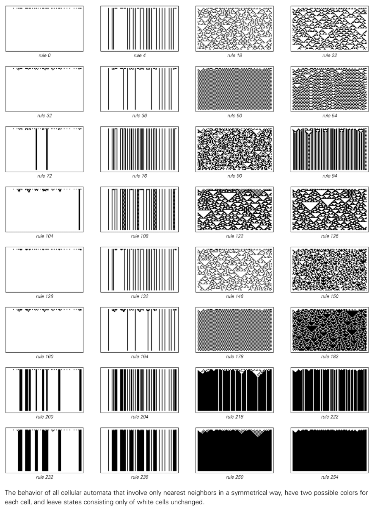
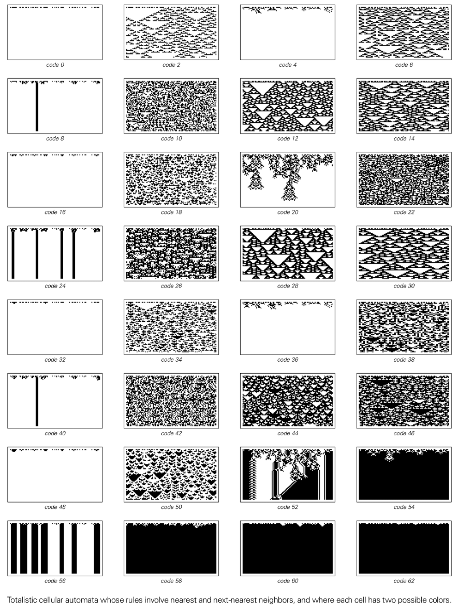
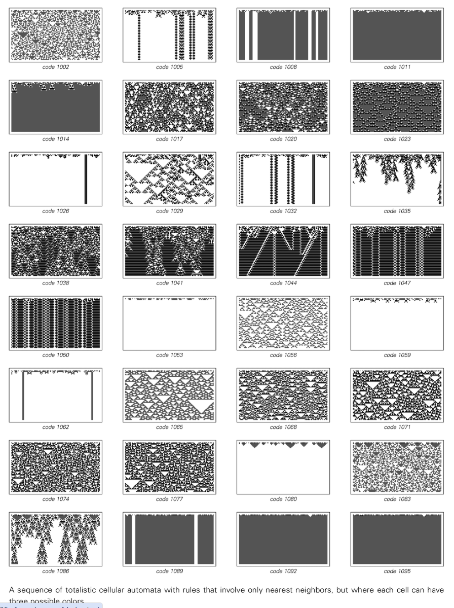

# 类别 1 元胞自动机

类别 1（Wolfram Class I）描述的是那些在短时间内迅速收敛到均匀或静态配置的元胞自动机行为。无论初始状态多么复杂，系统都会在有限步数后进入一个不再变化的固定点。

## 典型特征

- **快速收敛**：噪声迅速衰减，演化序列在少数几步后就停止变化。
- **最终状态简单**：最终图案通常是全黑、全白或由少量固定块组成的均匀结构。
- **缺乏传播**：局部扰动不会传播，信息被局限或直接消失。

## 代表规则

- 规则 0、8、32、40、128、136、160、168 等。

## 对应概念

- 与动力系统中的**不动点吸引子**类似。
- 在自然界中可类比为进入热平衡或晶体化后的稳定物质状态。

更多背景可参见[四种行为类别](annotation:four-classes-of-behavior)。
