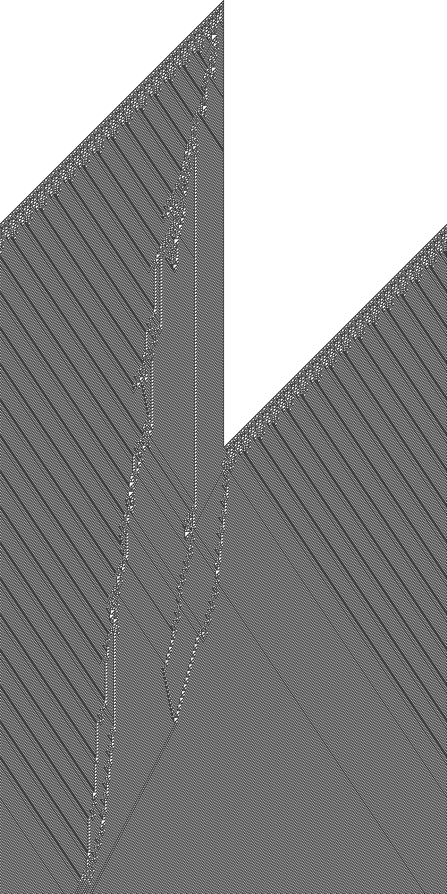
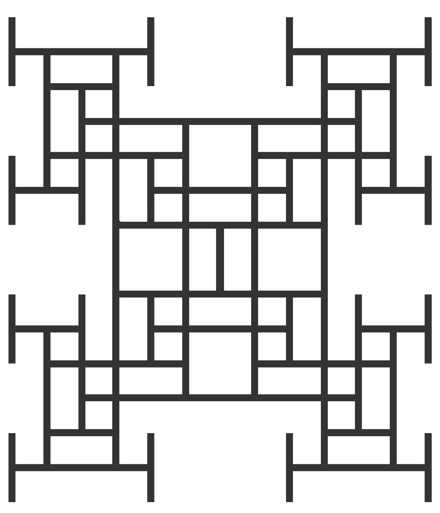
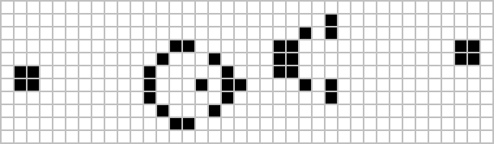
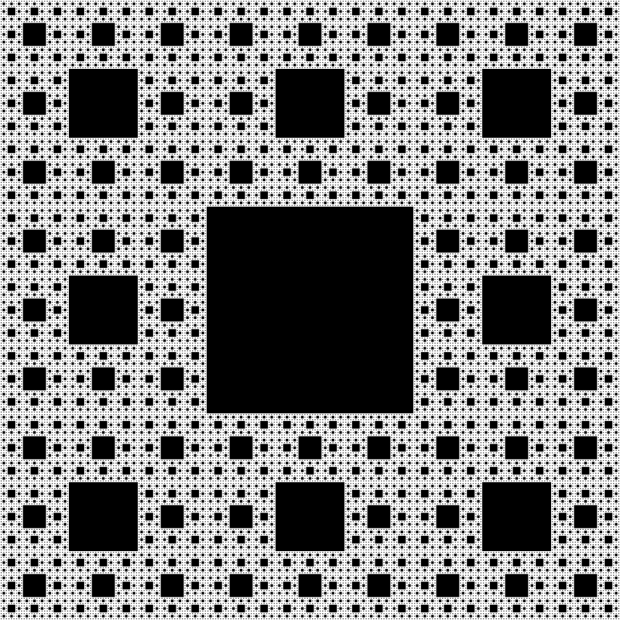
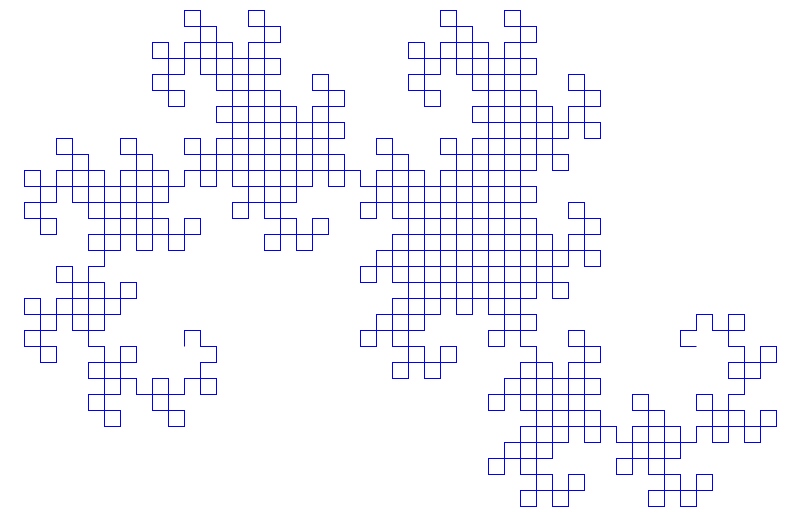

# 计算艺术与审美之美

简单的计算规则可以生成具有惊人审美品质的图像，这些图像往往让人联想到自然，但同时又独特新颖。这代表了艺术创作方式的根本转变——不仅仅通过人类直觉，还通过对计算可能性的系统探索。

## 元胞自动机作为艺术

*规则110元胞自动机仅用三个简单规则就创造出了具有显著视觉复杂性的精美黑白图案*

*牙签序列展示了几何生长规则如何创造出具有数学精确性和视觉吸引力的分形图案*

*康威生命游戏滑翔机枪图案——一个简单配置，仅通过四个基本规则就能持续生成滑翔机，创造出无限复杂性*

## 分形中的数学之美

*曼德布洛特集合从简单方程z² + c中显现出无限细节和惊人的视觉复杂性，展示了数学公式如何创造深刻的审美体验*

*通过递归细分创建的谢尔宾斯基地毯分形——从移除中心正方形的简单规则中涌现出无限复杂性*

*由L系统规则生成的龙形曲线分形——通过简单的递归折叠指令创造出优雅的自相似图案*

## 计算艺术的特征

### 简单起源，复杂之美
- **最小规则**：通常只需几行代码或数学方程
- **无限变化**：参数的微小改变创造出截然不同的美学效果
- **自然共鸣**：图案往往呼应自然界中的形式（贝壳、晶体、植物）
- **意外涌现**：美感的出现无需明确的美学编程

### 独特的视觉特性
- **自相似性**：图案在不同尺度上重复
- **有机感觉**：尽管起源于数字，结果往往感觉自然而生动
- **无限细节**：放大显示出更加精细的结构
- **动态潜力**：静态图像暗示着运动和成长

## 艺术应用

### 数字媒体
- 使用分形算法的屏幕保护程序和壁纸
- 基于元胞自动机演化的交互式装置
- 基于简单数学规则的生成式音乐可视化
- 音乐会和表演的实时图案生成

### 实体艺术
- 基于元胞自动机规则的织物图案
- 受分形几何启发的建筑设计
- 来自数学生长模式的雕塑形式
- 具有算法装饰的批量定制产品

### 设计创新
- 使用分形原理的标志设计
- 由简单程序生成的纺织图案
- 具有计算美学的用户界面元素
- 具有算法纹理的产品表面

## 历史背景

### 传统vs计算
- **古典艺术**：人类创造力、文化表达、情感内容
- **计算艺术**：算法美感、数学精确性、涌现美学
- **综合**：现代艺术家结合人类洞察与计算力量
- **新可能性**：无法手动探索的美学领域

### 先驱与发展
- 1960-70年代的早期计算机图形
- 1980年代贝诺伊特·曼德布洛特的分形可视化
- 斯蒂芬·沃尔夫勒姆的元胞自动机图案
- 使用简单规则的当代生成艺术家

## 哲学含义

### 美的本质
- **普遍原理**：暗示美可能有数学基础
- **涌现**：从简单起源产生的复杂美学反映自然过程
- **发现vs创造**：艺术家成为计算可能性的探索者
- **客观性**：独立于人类文化背景的数学美

### 艺术价值
- **创造力重新定义**：设计规则而非直接创造的技能
- **真实性**：关于算法艺术中作者身份的问题
- **独特性**：单一算法可能产生无限变化
- **意义**：无表征内容的抽象美

## 技术基础

### 关键算法
- **元胞自动机**：基于网格的局部规则演化
- **分形生成**：递归数学函数
- **L系统**：基于语法的生长模式
- **粒子系统**：从个体行为中涌现的模式

### 编程方法
- **基于规则**：定义简单的交互规则
- **参数探索**：数学常数的系统变化
- **随机元素**：图案生成中的受控机会
- **交互式设计**：算法参数的实时操作

## 当代相关性

### 数字时代艺术
- NFT和基于区块链的生成艺术
- 使用神经网络的AI辅助创作
- 实时响应式装置
- 虚拟和增强现实环境

### 可访问性
- 编程工具使非程序员也能接触算法艺术
- 分享和协作生成作品的在线平台
- 通过编程教授艺术的教育项目
- 开源算法民主化计算创造力

## 未来方向

### 新兴技术
- 量子计算创造新的美学可能性
- 使用生命系统进行艺术生成的生物计算
- 分形和元胞自动机结构的3D打印
- 虚拟现实实现沉浸式算法环境

### 艺术演化
- 人类-AI混合创意合作
- 响应环境数据的实时自适应艺术
- 生成原理的大规模建筑应用
- 图案生成的治疗和冥想应用

## 文化影响

### 博物馆和画廊展示
- 以算法艺术为特色的主要展览
- 计算作品的永久收藏
- 教授数学美的互动展品
- 艺术家与科学家的合作

### 教育应用
- 通过视觉图案探索教授数学
- 使用艺术动机的编程教育
- 结合艺术和计算机科学的跨学科课程
- 公众对复杂性和涌现的理解

计算艺术的探索揭示了审美美可能是某些数学结构的基本属性，通过系统探索而非仅仅通过文化传统就能接触到。这为艺术表达开辟了全新的领域，同时对创造力和美的本质提出了深刻的问题。

## 延伸阅读

- [生成艺术（维基百科）](https://en.wikipedia.org/wiki/Generative_art)
- [算法艺术（维基百科）](https://en.wikipedia.org/wiki/Algorithmic_art)
- [计算机艺术（维基百科）](https://en.wikipedia.org/wiki/Computer_art)
- [沃尔夫勒姆演示：艺术画廊](https://demonstrations.wolfram.com/topics.html?topic=Art)