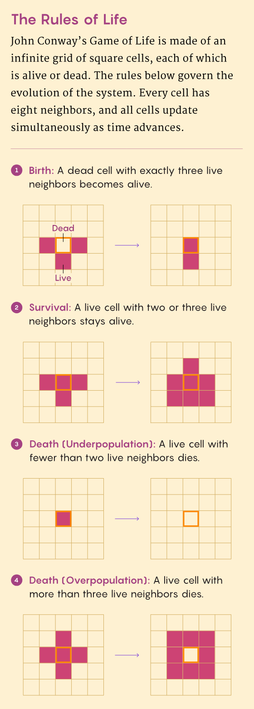
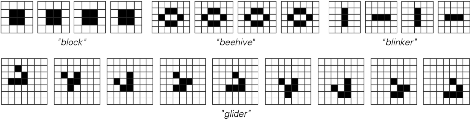
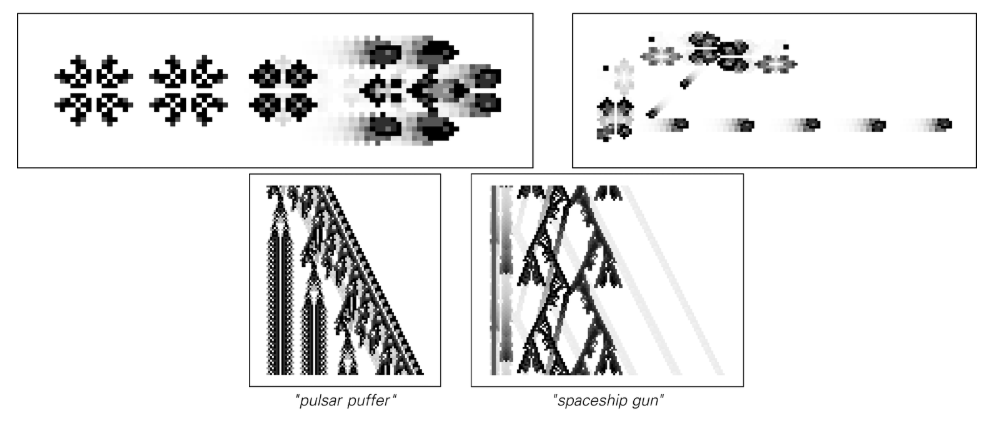

# 康威生命游戏

生命游戏（The Game of Life），通常简称为“生命”（Life），是数学家约翰·何顿·康威（John Horton Conway）在1970年创造的一种“零玩家游戏”。这意味着它的演化完全由其初始状态决定，无需玩家的进一步输入。

游戏在一个二维的细胞网格上进行，每个细胞有两种状态：“存活”或“死亡”。下一代中每个细胞的状态由其周围八个邻居的当前状态通过四条简单规则决定：

1.  **人口过少**：如果一个活细胞的邻居少于两个，它将死亡。
2.  **稳定存活**：如果一个活细胞有两个或三个邻居，它将存活到下一代。
3.  **人口过剩**：如果一个活细胞的邻居超过三个，它将死亡。
4.  **繁殖**：如果一个死细胞周围正好有三个活邻居，它将变为活细胞。

从这几条简单的规则中，可以涌现出各种各样复杂且不断演化的模式，包括稳定的“静物”、重复的“振荡器”以及像著名的“滑翔机”一样在网格上移动的“宇宙飞船”。生命游戏是一个深刻的例子，展示了巨大的复杂性如何从简单的初始状态和规则中产生，这也是《一种新科学》的核心主题。

## 历史背景与流行文化

- 1970 年，马丁·加德纳在《科学美国人》的“数学游戏”专栏首次报道生命游戏，迅速引发全球兴趣。
- 生命游戏成为早期“黑客文化”和个人计算机社区的标志性示例，许多爱好者编写程序模拟其演化。
- 它启发了无数艺术、音乐、电影与文学创作，象征着自组织与生命出现的隐喻。

## 典型结构

- **静物（Still lifes）**：如方块（Block）、船（Boat）、蜂巢（Beehive），这些模式一旦出现便保持不变。

- **振荡器（Oscillators）**：如闪烁器（Blinker）、蟾蜍（Toad）、脉冲星（Pulsar），以固定周期重复。

- **宇宙飞船（Spaceships）**：滑翔机（Glider）、轻型飞船（Lightweight Spaceship, LWSS）等，会在网格上移动。

- **滑翔机枪（Glider guns）**：Gosper 滑翔机枪等结构能够持续产生滑翔机，实现无限增长。

- **复杂机器**：通过组合滑翔机、反射器与逻辑门，人们构建了寄存器、计数器乃至完整的图灵机。

## 计算意义

- 生命游戏已被证明是图灵完备的，理论上可以模拟任何计算过程。
- 其演化体现了计算不可简化性：很难对模式的长期行为做出简洁预测，必须逐步演算。
- 作为研究复杂系统、涌现现象和人工生命的经典基准，被广泛用于教学与实验。

## 资源与工具

- [ConwayLife.com](https://www.conwaylife.com/)：收录大量模式库、讨论与工具。
- Golly、LifeViewer 等开源软件可高效模拟生命游戏及其变体。
- 康威逝世后，研究者仍在探索新结构，例如更快的宇宙飞船和更紧凑的通用构造。
