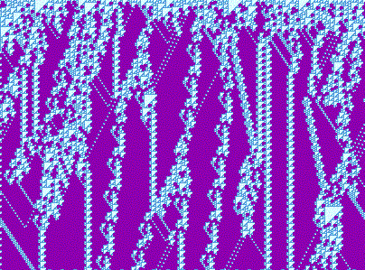

# 涌现（Emergence）

在 NKS 语境中，“涌现”指由极其简单的局部规则反复作用，自下而上生成出宏观上全新且不可由局部直推的结构与行为。

## NKS 要点
- 局部→全局：宏观性质并非局部性质的线性叠加，而是迭代与相互作用的产物。
- 四类行为地基：均匀、重复、嵌套、近似随机均可由简单规则涌现，其中类别3/4尤示“强涌现”。
- 不可简化性：对许多系统，除逐步演化外难以更快地预测其长程结果；观察与可视化是首要手段。

## 代表性计算例子
- 规则 30：从最简单初始（单黑元）与极简局部规则出发，持续生成近似随机纹理与长程相关。

- 规则 110：在周期背景上产生持久、可相互作用的局部结构（“滑翔机”与碰撞产物），显露信息承载与处理的雏形。

## 与“复杂性”的区分（简述）
- 涌现强调“生成过程与机制”；复杂性更像“当前状态与程度”。
- 涌现常表现为有结构的模式（嵌套分形、局部结构互动），不等同于无结构的杂乱。

## 为什么重要（方法论）
- 放下先验方程的特权：从极简程序出发做枚举与可视化，直观识别宏观模式与规律。
- 跨模型一致性：一维/二维/网络/多路等不同载体反复出现相似涌现结构，支持“无特权形式”的观点。
- 面向工程设计：利用简单局部规则构造可扩展、鲁棒且富表现力的系统（并行、去中心、易组合）。

## 自然类比（概览）
- 生物：形态生成、信号与调控网络、群体协同。
- 物理：晶体生长、界面粗化、湍流纹理与统计规律。
- 社会：个体交互规则下的集体模式与制度结构。
