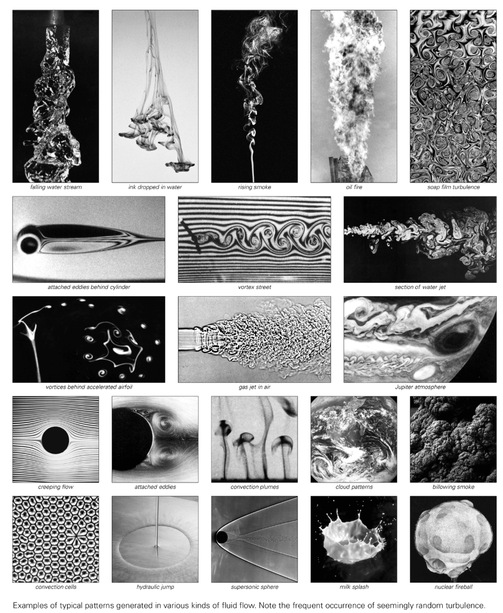

# 流体流动

流体流动（Fluid Flow）涵盖液体或气体在空间中的运动形态，核心由速度场、压力场及其随时间的演化组成。研究对象涵盖层流、湍流、涡旋、激波等多样现象。

## 层流与湍流
- **层流（Laminar Flow）**：流线平行、剪切较小，通常在低雷诺数条件下出现。
- **湍流（Turbulence）**：速度与压力随时间和空间高度波动，伴随涡量注入与能量级联，是经典难题之一。

## 计算模型
- **格子气/格子玻尔兹曼**：在离散网格上以简单碰撞与传播规则模拟流体宏观行为。
- **元胞自动机**：以离散粒子规则生成涡街、湍流尾迹等结构，强调“内禀随机性”。
- **偏微分方程**：纳维-斯托克斯方程描述连续介质中的动量与质量守恒，是传统理论基础。

## NKS 视角
- 简单程序（如格子气元胞自动机）即可再现层流到湍流的转变，揭示随机性可由确定性规则内生产生。
- 与“连续性现象”讨论呼应：宏观平滑流场可以由微观离散粒子平均而得。

## 相关概念
- 雷诺数（Reynolds Number）
- 涡旋与卡门涡街
- 计算不可简化性（预测湍流需逐步模拟）

## 延伸阅读
- [Fluid dynamics（维基百科）](https://en.wikipedia.org/wiki/Fluid_dynamics)
- [Turbulence（维基百科）](https://en.wikipedia.org/wiki/Turbulence)
- [Lattice Boltzmann method（维基百科）](https://en.wikipedia.org/wiki/Lattice_Boltzmann_methods)
