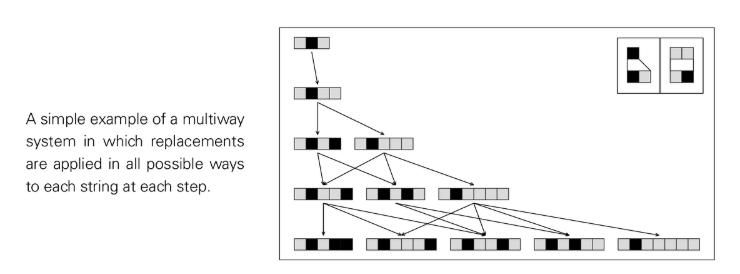

# 多路系统（Multiway Systems）

多路系统允许在每一步同时执行所有可行的替换/更新，从而生成一簇并行的后继状态（分支）。这些状态之间的因果关系可视为一张网络：不同历史路径可能在后续步骤重新汇合到同一状态。

## NKS 视角的关键点
- 分支而非唯一演化：与单路径演化的元胞自动机/替换系统对照，揭示“可能历史”的结构。
- 因果网络表示：将每个唯一状态作为节点，用有向边连接“产生”关系，得到可视化良好的因果几何。
- 四类行为仍适用：状态集规模与结构既可呈现规则增长与重复，也可出现嵌套层级或近似随机的复杂图案。
- 路径汇合与宏观唯一性：不同路径最终若频繁汇合，则大尺度下可能呈现“近似唯一历史”。

## 与替换/顺序系统的关系
- 顺序替换系统：每步仅做一次替换；多路系统：每步做所有可能替换并去重。
- 两者在小规则集下都能出现从简单到复杂的全谱行为，多路视角强调“选择空间”的整体结构。

## 方法与观测建议
- 规则扫描：统计每步状态数增长（线性、二次、指数）、是否出现长周期或汇合簇。
- 网络度量：跟踪因果网络的团数、直径、聚类与层级，以识别嵌套与随机区域的共存。

## 外部参考（概念）
- Multiway systems（Wolfram 相关资料）
