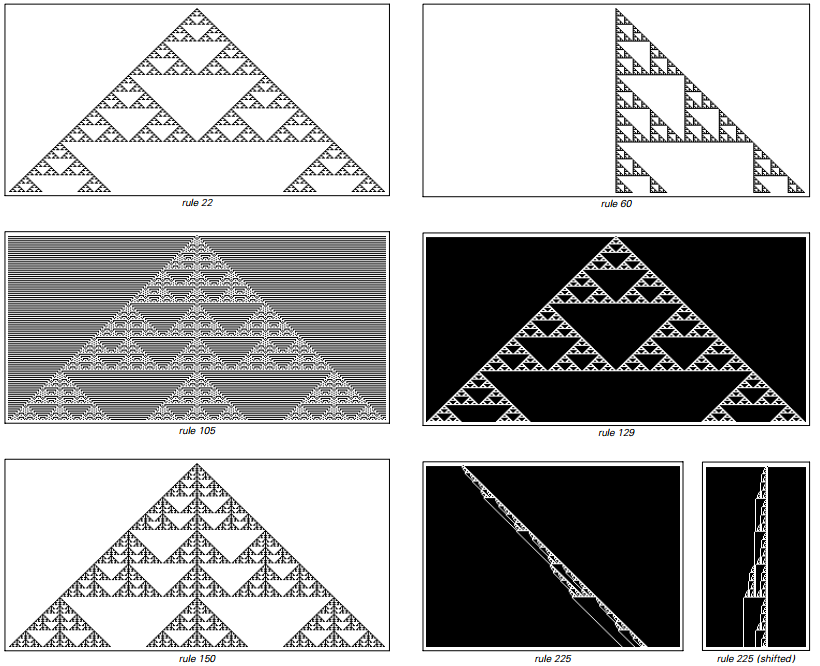
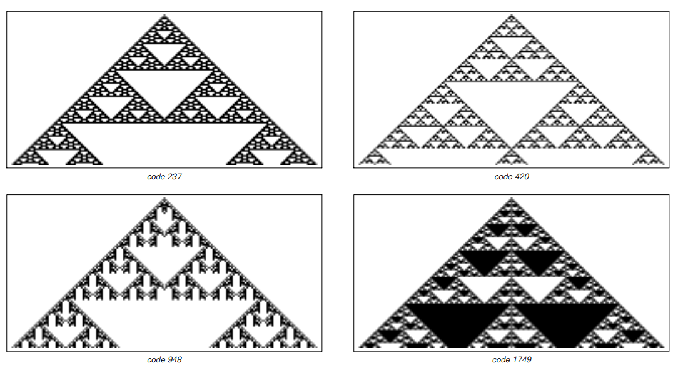

# 嵌套（Nested）

在《一种新科学》（NKS）框架中，“嵌套”指在多尺度上重复出现的自相似结构。它是四类典型行为（均匀、重复、嵌套、近似随机）之一，常由极其简单的离散规则自然涌现。

## 为何在 NKS 中重要
- 行为分类基准：嵌套与“均匀/重复/随机”并列，构成观察复杂系统的第一层分类。
- 简单规则→丰富形态：无需复杂设计，仅靠局部更新即可出现长程结构与多尺度纹理。
- 可分析与可压缩：相较随机行为，嵌套更易解释、预测与压缩（有规律、可加性、可分解）。

## 典型系统与机制

### 基本元胞自动机（ECA）
- 规则90（加性/可加性）：从单个黑元出发产生谢尔宾斯基三角形式的嵌套图案；其演化与二项式系数模2（帕斯卡三角形 mod 2）密切相关。
- 规则150：同属加性类，呈现更复杂的嵌套分形纹理。

### 总和/总括（Totalistic）与多色规则
- 多色或总和规则在二维或更高色阶下，仍常出现清晰的嵌套分形。
- 这说明“嵌套”并非一维或二值系统的特例，而是跨设定普遍存在的行为类型。

## NKS 风格的理解方法
- 可加性与叠加：加性规则可将复杂图案视作多个简单激发的叠加，从而解释其规律性与可压缩性。
- 局部规则到全局形态：严格局部的更新，反复迭代即可构造跨尺度的几何结构，体现“自下而上”的生成范式。
- 维度与普遍性：从一维到二维、三维，嵌套仍大量出现，支持“复杂性并非依赖高维度”的总体论断。

## 与随机与重复的对照
- 与重复相比：嵌套缺乏单一周期，但在多尺度上保持结构规律。
- 与近似随机相比：嵌套可见清晰几何与层级规律，信息密度与可压缩性更高。

## 进一步阅读（外部）
- NKS 在线版：Section 3.3（嵌套分形与可加性）
- Sierpinski triangle（背景数学与可视化）
- [分形几何（维基百科）](https://en.wikipedia.org/wiki/Fractal)
- [谢尔宾斯基三角形（维基百科）](https://en.wikipedia.org/wiki/Sierpinski_triangle)
- [元胞自动机中的嵌套模式](https://www.wolframscience.com/nksonline/section-3.3)
- [分形在自然界中的应用](https://en.wikipedia.org/wiki/Factals_in_nature)
