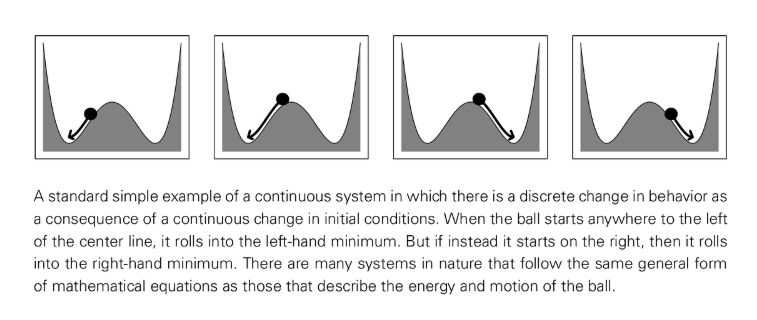

# 相变

相变（Phase Transition）指的是系统在控制参数缓慢变化时，于某个临界点出现的突然而宏观可观测的状态转变。经典例子包括冰水共存点的固液转换、铁磁材料在居里温度处失去磁化、以及流体从层流到湍流的跃迁。

## 关键特征
- **临界阈值**：温度、压力、密度等参数达到临界值时，系统状态被迫改变。
- **离散结果**：即便底层动力学连续，宏观变量会呈现分段或跳跃变化。
- **尺度发散**：在临界点附近常出现相关长度和涨落尺度的发散，导致跨尺度的协同行为。

## NKS 视角
- 说明简单局域规则也能在参数变化时产生突变行为，与统计物理中的相变现象呼应。
- 佐证“离散性从连续机制中涌现”的观点：即便规则平滑，结果仍可能离散或多稳态。
- 在元胞自动机中，通过调节初始密度或更新阈值即可看到类似的突变。

## 相关概念
- 临界现象
- 自发对称性破缺
- 可计算不可简化性（参数微调也需逐步模拟才能预测）

## 延伸阅读
- [Phase transition（维基百科）](https://en.wikipedia.org/wiki/Phase_transition)
- [Critical phenomena（维基百科）](https://en.wikipedia.org/wiki/Critical_phenomena)
- [Order parameter（维基百科）](https://en.wikipedia.org/wiki/Order_parameter)
