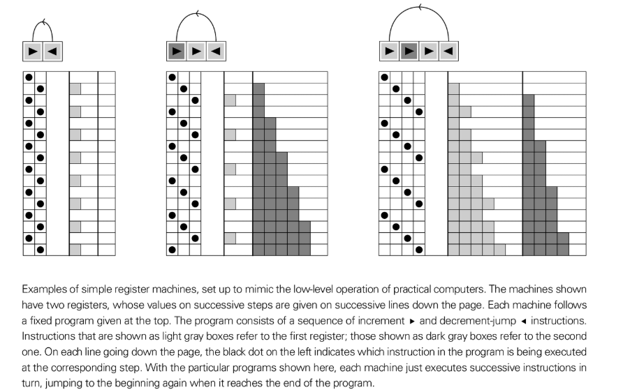

# 寄存器机

寄存器机（Register Machine）是计算机中央处理器（CPU）的一个简单的抽象模型。它被设计成对实际计算机在最低级别上如何工作的清晰理想化。

## 工作原理

寄存器机由以下部分组成：

1.  **寄存器**：少量的存储位置，每个位置可以容纳任意大小的数字。
2.  **程序**：机器按顺序执行的固定简单指令列表。

在书中，沃尔夫拉姆考虑的寄存器机只有两个寄存器和两种类型的指令：

- **增量**：将特定寄存器中的数字加一。
- **减量并跳转**：将特定寄存器中的数字减一。如果数字已经是零，则不执行任何操作。然后，如果数字*不*是零，则跳转到程序列表中的另一个指令；否则，只继续执行下一条指令。

## 意义

使这些机器功能强大的特性是**减量并跳转**指令。它允许机器根据其寄存器中的值做出决策并在其程序中采取不同的路径。这是现代计算机中所有分支和逻辑（例如，`if/else`语句）的基础。

沃尔夫拉姆对寄存器机的探索表明，即使使用极其简单的程序（例如，8条指令和2个寄存器），也可能产生行为复杂到看起来随机且计算上不可约化的程度。这是一个深刻的结果，因为它意味着我们日常使用的最基本的计算机模型中，也存在着最高级别复杂性的潜力。