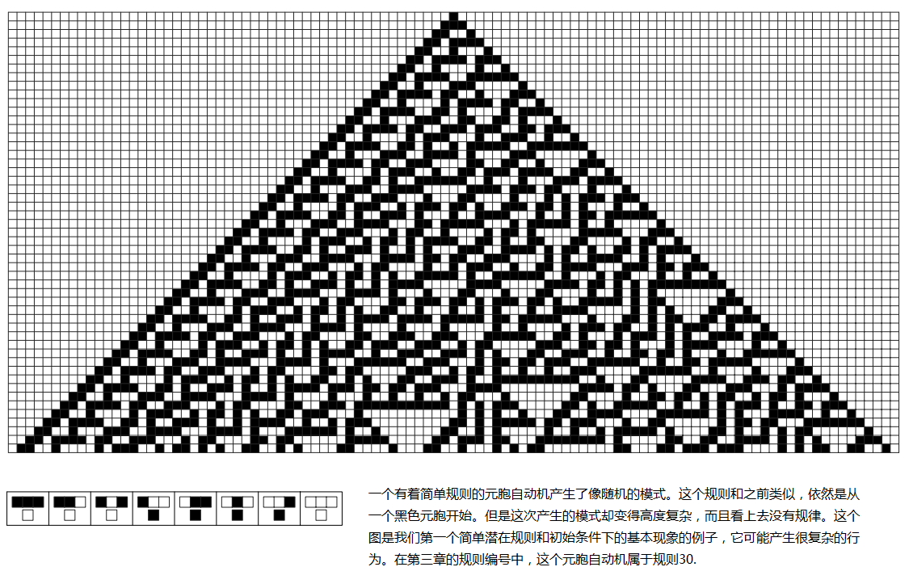

# 规则30

规则30是斯蒂芬·沃尔夫拉姆发现的最著名的[基本元胞自动机](https://en.wikipedia.org/wiki/Elementary_cellular_automaton)之一。尽管其规则结构极其简单，但它产生复杂的、看似随机的图案，彻底改变了我们对复杂性如何从简单性中涌现的理解。

## 规则定义

规则30作用于一维单元格阵列，每个单元格可以是黑色（1）或白色（0）。该规则根据每个单元格的当前状态及其两个直接邻居的状态来确定其下一个状态。

*规则30从单个黑色单元格的早期演化，显示了特征性的嵌套图案和新兴复杂性*

*规则30的详细演化，展示了从简单规则产生的复杂随机性*

*规则30经过更多步数的演化，显示了持续的复杂性和随机性*

*规则30经过500次迭代后，展现了从简单初始条件中产生的完整复杂性*

该规则可以表示为一个简单的查找表：
- 111 → 0
- 110 → 0  
- 101 → 0
- 100 → 1
- 011 → 1
- 010 → 1
- 001 → 1
- 000 → 0

二进制表示（00011110）等于十进制的30，因此称为"规则30"。

## 关键特性

### 从简单性产生复杂性
- **局部简单性**：每个单元格只考虑三个邻居
- **全局复杂性**：产生复杂的、看似随机的图案
- **确定性**：尽管看起来随机，但每一步都是完全确定的

### 计算特性
- **不可简化性**：无法在不运行完整计算的情况下简化或预测
- **对初始条件敏感**：起始配置的小变化导致截然不同的结果
- **伪随机生成**：在Mathematica的随机数生成器中使用

## 视觉图案

*详细的元胞自动机可视化，显示规则30的演化图案和结构*

当规则30从简单的初始条件（通常是单个黑色单元格）运行时，它生成一个三角形图案，具有：
- 复杂的、嵌套结构的中央脊
- 显示嵌套三角形图案的左侧
- 看起来完全随机的右侧

## 科学意义

### 范式转变
规则30挑战了科学中的基本假设：
- 推翻了简单规则必然导致简单行为的观念
- 证明了表面的随机性可以从确定性过程中产生
- 显示了复杂性在简单计算系统中是普遍存在的

### 应用
- **密码学**：用于生成伪随机序列
- **计算机科学**：并行计算和算法分析的模型
- **物理学**：为[混沌系统](https://en.wikipedia.org/wiki/Chaos_theory)和[统计力学](https://en.wikipedia.org/wiki/Statistical_mechanics)提供见解
- **生物学**：帮助理解自然系统中的图案形成

## 与自然的联系

规则30的图案与以下现象有着惊人的相似性：
- 软体动物的贝壳图案
- 动物的色素沉着图案
- 流体湍流
- 晶体生长图案

这表明类似的简单规则可能是整个自然界图案形成的基础。

## 延伸阅读

- [沃尔夫拉姆1983年的原始论文](https://www.stephenwolfram.com/publications/cellular-automata-irreversibility-randomness/)
- [基本元胞自动机（维基百科）](https://en.wikipedia.org/wiki/Elementary_cellular_automaton)
- [规则30（维基百科）](https://en.wikipedia.org/wiki/Rule_30)