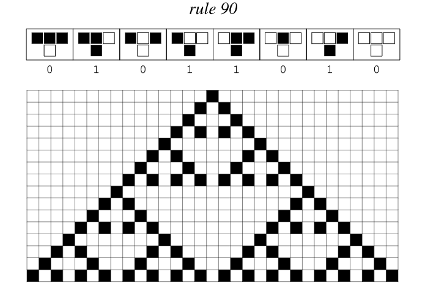

# 规则 90

规则 90 是最简单的[基本元胞自动机](https://en.wikipedia.org/wiki/Elementary_cellular_automaton)之一，也是“可加性”规则的典型代表。尽管它的局部规则极其简洁，却能产生著名的谢尔宾斯基三角形等自相似结构，为理解从简单原则生成复杂图案提供了一个清晰样本。

## 规则定义

规则 90 在一维线上演化，每个元胞只有黑（1）与白（0）两种状态。其更新方式是对左右邻居做异或：

- 如果左右邻居相同，下一步该元胞为 0；
- 如果左右邻居不同，下一步该元胞为 1。

因此局部查表为：
- 111 → 0
- 110 → 1
- 101 → 0
- 100 → 1
- 011 → 1
- 010 → 0
- 001 → 1
- 000 → 0

二进制输出序列 `01011010` 对应十进制值 90，即名称由来。

## 关键特性

- **可加性**：演化可以视为对初始状态执行线性叠加，因此复杂图案等于不同初始片段的 XOR 组合。
- **分形结构**：从单个黑元胞开始会生成谢尔宾斯基三角形；从其他周期初始条件也会产生自相似嵌套图案。
- **可预测性**：由于可加性，演化可以用线性代数或二进制多项式精确分析。
- **对称性**：图案在左右方向呈镜像对称，并显示明显的尺度层级。

## 研究意义

- 提供了理解线性元胞自动机与复杂图案形成之间关系的简单示例。
- 与[规则 30](annotation:rule-30)等非线性随机系统形成鲜明对比，展示初始条件如何直接决定最终结构。
- 用于教学和演示，可视化二进制帕斯卡三角形、组合数奇偶性等数学主题。

## 延伸阅读

- [规则 90（维基百科）](https://en.wikipedia.org/wiki/Rule_90)
- [Elementary Cellular Automaton](https://mathworld.wolfram.com/ElementaryCellularAutomaton.html)
- 《一种新科学》中关于嵌套结构与可加性规则的讨论
