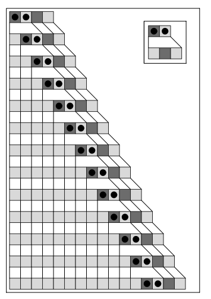

# 顺序替换系统

顺序替换系统（Sequential Substitution System）是[替换系统](annotation:substitution-systems)的一种变体，其操作方式更像典型文本编辑器中的“查找和替换”功能。

## 工作原理

顺序替换系统不是同时替换所有元素，而是从左到右扫描序列，并仅对它找到的**第一个匹配项**执行替换。

1.  **定义一组替换规则**：例如，`{ AB → BA, B → A }`。
2.  **从左侧扫描**：从序列的开头开始。
3.  **找到第一个匹配项**：寻找任何规则左侧的第一次出现。
4.  **执行一次替换**：替换那个单一匹配的序列。
5.  **重复**：从新形成的序列的开头重新开始扫描。

如果存在多个规则，系统可能会按特定顺序尝试它们，或者它可能会重复扫描一个规则，只有在找不到匹配项时才移至下一个规则。

## 意义

这类系统之所以重要，是因为它紧密地模拟了我们日常使用的常见计算过程。研究这些系统得出的非凡结论是，即使是基本文本编辑器中可用的简单操作，也能够产生巨大复杂性（类别3和4）的行为。

这一发现强化了本书的中心主题：复杂的计算不是一种高级、复杂的现象，而是内在于即使是最简单的基于规则的过程中。